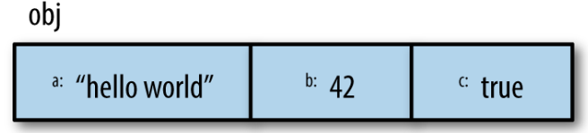
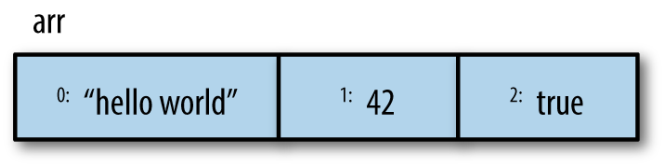
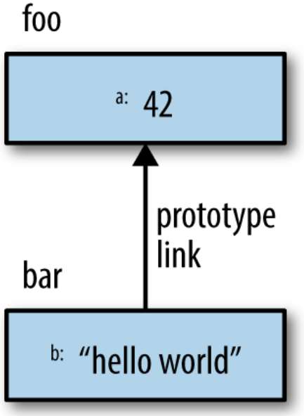

# "Ви не знаєте JS" Кайл Сімпсон

## Книга перша - "Почніть та вдосконалюйтесь" (Up & Go)

### Зміст

<details style="border: 1px solid #ccc; border-radius: 5px; margin-bottom: 10px; padding: 10px; background-color: #f9f9f9;">
  <summary style="cursor: pointer; font-weight: bold; font-size: 1.2em; color: #333;  padding: 8px; border-radius: 5px;">
    Передмова
  </summary>
  <div style="margin-top: 10px; padding: 10px; border-top: 1px solid #ccc; color: #000">
    
Що останнє нове ви вивчили?

Можливо, це була іноземна мова, як-от італійська чи німецька. Або, можливо, це був графічний редактор, як-от Photoshop. Чи техніка приготування їжі, або деревообробка, чи комплекс вправ. Я хочу, щоб ви згадали те відчуття, коли ви нарешті зрозуміли: той момент осяяння. Коли все перейшло від розмитого до кришталево чіткого, коли ви опанували циркулярну пилку чи зрозуміли різницю між чоловічим і жіночим родом іменників у французькій мові. Як це відчувалося? Досить неймовірно, чи не так?

А тепер я хочу, щоб ви повернулися трохи далі у своїх спогадах, до моменту перед тим, як ви опанували свою нову навичку. Як ви почувалися тоді? Мабуть, було трохи лячно і, можливо, трохи дратувало, правда ж? Колись ми всі не знали того, що знаємо зараз, і це цілком нормально – всі ми з чогось починаємо. Вивчення нового матеріалу – це захоплива пригода, особливо якщо ви прагнете опанувати предмет ефективно.

Я викладаю багато початкових курсів з програмування. Студенти, які відвідують мої заняття, часто намагалися самостійно вивчати такі предмети, як HTML чи JavaScript, читаючи блоґи або копіюючи та вставляючи код, але їм не вдалося по-справжньому опанувати матеріал, який дозволив би їм писати код для досягнення бажаного результату. І оскільки вони не до кінця розуміють усі тонкощі певних тем програмування, вони не можуть писати потужний код чи налагоджувати власні розробки, бо насправді не розуміють, що відбувається.

Я завжди вірю в правильне викладання на своїх заняттях, тобто я навчаю веб-стандартів, семантичної розмітки, коду з належними коментарями та інших найкращих практик. Я висвітлюю предмет ґрунтовно, пояснюючи як і чому, замість того, щоб просто викидати код для копіювання та вставлення. Коли ви прагнете зрозуміти свій код, ви створюєте кращі роботи і стаєте кращими в тому, що робите. Код перестає бути просто вашою роботою, він стає вашим ремеслом. Саме тому я в захваті від "Почніть та вдосконалюйтесь". Кайл веде нас у глибоке занурення через синтаксис та термінологію, щоб дати чудовий вступ до JavaScript без зрізання кутів. Ця книга не ковзає по поверхні, а дійсно дозволяє нам по-справжньому зрозуміти концепції.

Адже недостатньо просто вміти копіювати фрагменти jQuery у свій вебсайт, так само як недостатньо навчитися відкривати, закривати та зберігати документ у Photoshop. Звісно, коли я вивчив кілька основ програми, я міг створювати та ділитися зробленим дизайном. Але без справжнього знання інструментів та того, що за ними стоїть, як я можу визначити сітку, або створити читабельну систему шрифтів, або оптимізувати графіку для використання в вебі. Те саме стосується JavaScript. Не знаючи, як працюють цикли, як визначати змінні чи що таке область видимості, ми не писатимемо найкращий код, на який здатні. Ми не хочемо погоджуватися на щось менше — це все-таки наше ремесло.

Чим більше ви стикаєтеся з JavaScript, тим зрозумілішим він стає. Слова на кшталт замикань, об'єктів та методів можуть здаватися вам зараз недосяжними, але ця книга допоможе цим термінам стати зрозумілими. Я хочу, щоб ви пам'ятали ті два відчуття – до і після вивчення чогось – коли починаєте читати цю книгу. Це може здаватися складним, але ви взяли цю книгу до рук, тому що розпочинаєте чудову подорож до вдосконалення своїх знань. "Почніть та вдосконалюйтесь" – це початок нашого шляху до розуміння програмування. Насолоджуйтесь моментами осяяння!

_—Jenn Lukas (http://jennlukas.com, @jennlukas),
Frontend consultant_

  </div>
</details>

<details style="border: 1px solid #ccc; border-radius: 5px; margin-bottom: 10px; padding: 10px; background-color: #f9f9f9;">
  <summary style="cursor: pointer; font-weight: bold; font-size: 1.2em; color: #333; padding: 8px; border-radius: 5px;">
    Вступ
  </summary>
  <div style="margin-top: 10px; padding: 10px; border-top: 1px solid #ccc; color: #000">

Я впевнений, ви помітили, але "JS" у назві серії – це не абревіатура слів для лайки про JavaScript, хоча лаятися через дивацтва цієї мови – це те, з чим ми, мабуть, усі можемо себе ототожнити!

Від найперших днів Вебу JavaScript був фундаментальною технологією, що керує інтерактивним досвідом навколо контенту, який ми споживаємо. Хоча JavaScript починався з мерехтливих слідів від миші та надокучливих спливаючих вікон, майже два десятиліття потому технологія та можливості JavaScript зросли на багато порядків, і мало хто сумнівається в його важливості в самому серці найдоступнішої програмної платформи світу: Вебу.

Але як мова програмування, вона постійно була мішенню для численної критики, частково через своє походження, але ще більше через свою філософію проєктування. Навіть сама назва викликає, як одного разу висловився Брендан Айк, статус "тупого молодшого брата" поруч з його більш зрілим старшим братом, Java. Але ця назва – лише випадковість політики та маркетингу. Ці дві мови надзвичайно різні в багатьох важливих аспектах. "JavaScript" настільки ж пов'язаний з "Java", як "карнавал" з "каром".

Оскільки JavaScript запозичує концепції та синтаксичні ідіоми з кількох мов, включаючи горді процедурні корені в стилі C, а також витончені, менш очевидні функціональні корені в стилі Scheme/Lisp, він надзвичайно доступний для широкої аудиторії розробників, навіть тих, хто має мало або взагалі не має досвіду програмування. "Hello World" у JavaScript настільки простий, що мова є привабливою та легкою для освоєння при першому знайомстві.

Хоча JavaScript, можливо, є однією з найпростіших мов для початку роботи, його особливості роблять ґрунтовне опанування мови значно рідшим явищем, ніж у багатьох інших мовах. Якщо для написання повномасштабної програми потрібне досить глибоке знання такої мови, як C чи C++, то повномасштабна продакшн-розробка на JavaScript може, і часто так і відбувається, лише поверхнево торкатися можливостей мови.

Складні концепції, що глибоко вкорінені в мову, натомість зазвичай проявляють себе в начебто спрощений спосіб, як-от передача функцій як зворотних викликів, що заохочує розробника JavaScript просто використовувати мову як є і не надто перейматися тим, що відбувається під капотом.

Це одночасно проста, легка у використанні мова, що має широку привабливість, та складна й нюансована сукупність мовних механізмів, які без ретельного вивчення вислизають від справжнього розуміння навіть для найдосвідченіших JavaScript-розробників.

У цьому й полягає парадокс JavaScript, ахіллесова п'ята мови, виклик, який ми зараз розглядаємо. Оскільки JavaScript можна використовувати без розуміння, справжнє розуміння мови часто так і не досягається.

### Місія

Якщо щоразу, коли ви натрапляєте на несподіванку чи розчарування в JavaScript, ваша реакція – додати це до чорного списку (як дехто звик робити), ви скоро будете обмежені лише порожньою оболонкою багатства JavaScript.

Хоча цей підмножина славнозвісно названа "Хорошими частинами" (The Good Parts), я б благав вас, шановний читачу, натомість розглядати її як "Легкі частини", "Безпечні частини" чи навіть "Неповні частини".

Ця серія "Ви не знаєте JS" пропонує протилежний виклик: вивчити та глибоко зрозуміти весь JavaScript, включно й особливо "Складні частини".

Тут ми безпосередньо розглядаємо тенденцію JavaScript-розробників вчити рівно стільки, щоб справлятися з роботою, ніколи не змушуючи себе дізнатися точно, як і чому мова поводиться саме так. Більше того, ми відкидаємо поширену пораду відступати, коли шлях стає складним.

Я не задовольняюся, і ви не повинні задовольнятися тим, щоб зупинятися, коли щось просто працює, не розуміючи чому. Я м'яко закликаю вас вирушити цим вибоїстим "менш второваним шляхом" і прийняти все, чим є і що може робити JavaScript. З цими знаннями жодна техніка, жоден фреймворк і жоден популярний модний акронім тижня не буде поза межами вашого розуміння.

Кожна з цих книг розглядає конкретні базові частини мови, які найчастіше неправильно розуміють або недостатньо розуміють, і занурюється в них глибоко та вичерпно. Після прочитання ви повинні набути твердої впевненості у своєму розумінні не лише теоретичних аспектів, а й практичних моментів, які "потрібно знати".

JavaScript, який ви знаєте зараз, ймовірно, складається з частин, переданих вам іншими, які обпеклися через неповне розуміння. Цей JavaScript – лише тінь справжньої мови. Ви ще не справді знаєте JavaScript, але якщо ви заглибитеся в цю серію, то пізнаєте. Читайте далі, мої друзі. JavaScript чекає на вас.

### Огляд

JavaScript - чудовий. Його легко вивчити частково, і набагато складніше вивчити повністю (чи навіть достатньо). Коли розробники стикаються з незрозумілими моментами, вони зазвичай звинувачують мову замість свого нерозуміння. Ці книги мають на меті це виправити, надихаючи на глибоку повагу до мови, яку ви тепер можете і повинні ґрунтовно знати.

**Примітка:** _Багато прикладів у цій книзі розраховані на сучасні (та орієнтовані на майбутнє) середовища рушіїв JavaScript, такі як ES6. Деякий код може не працювати так, як описано, якщо запускати його на старіших (до-ES6) рушіях._

### Умовні позначення, що використовуються в цій книзі

У цій книзі використовуються такі типографічні умовності:

_Курсив_

Позначає нові терміни, URL-адреси, електронні адреси, назви файлів і розширення файлів.

`Моноширинний шрифт`

Використовується для програмного коду, а також у межах абзаців для позначення елементів програми, таких як назви змінних чи функцій, бази даних, типи даних, змінні середовища, оператори та ключові слова.

**`Моноширинний жирний`**

Показує команди чи інший текст, який користувач повинен вводити дослівно.

_`Моноширинний курсив`_

Показує текст, який має бути замінений значеннями, що надає користувач, або значеннями, які визначаються контекстом.

  </div>
</details>

<details id="section1" style="border: 1px solid #ccc; border-radius: 5px; margin-bottom: 10px; padding: 10px; background-color: #f9f9f9;">
<summary style="cursor: pointer; font-weight: bold; font-size: 1.2em; color: #333; padding: 8px; border-radius: 5px;">
    РОЗДІЛ 1
</summary>

<div style="margin-top: 10px; padding: 10px; border-top: 1px solid #ccc; color: #000">

### Введення в програмування

Ласкаво просимо до серії книг "Ви не знаєте JS" (YDKJS).

"Почніть та вдосконалюйтесь" є вступом до кількох базових концепцій програмування – звісно, ми схиляємося конкретно до JavaScript (часто скорочується як JS) – і того, як підходити до розуміння решти книг цієї серії. Особливо якщо ви тільки починаєте знайомитися з програмуванням та/або JavaScript, ця книга коротко розгляне все, що вам потрібно для початку роботи.

Ця книга починається з пояснення базових принципів програмування на дуже високому рівні. Вона здебільшого призначена для тих, хто починає вивчення YDKJS з невеликим досвідом програмування або взагалі без нього, і розглядає ці книги як допомогу в розумінні програмування через призму JavaScript.

Якщо ви вже досить добре знайомі з JavaScript, спочатку погляньте на [Главу 3](#section3), щоб коротко ознайомитися з тим, чого очікувати від YDKJS, а потім сміливо починайте!

До Розділу 1 варто підходити як до швидкого огляду речей, які ви захочете вивчити глибше та попрактикувати для входження в програмування. Також існує багато інших чудових ресурсів для знайомства з програмуванням, які можуть допомогти вам глибше зануритися в ці теми, і я заохочую вас вчитися з них на додаток до цього розділу.

Коли ви почуватиметеся впевнено з загальними основами програмування, [Глава 2](#section2) допоможе вам познайомитися з особливостями програмування на JavaScript. [Глава 2](#section2) знайомить з тим, що таке JavaScript, але знову ж таки, це не вичерпний посібник – для цього існують інші книги серії YDKJS!

<!-- ================ subsection ================ -->

<div style="margin-top: 10px; padding: 10px; border-top: 1px solid #ccc; color: #000">
<details style="border: 1px solid #ccc; border-radius: 5px; margin-bottom: 10px; padding: 10px; background-color: #f9f9f9;">
<summary style="cursor: pointer; font-weight: bold; font-size: 1.1em; color: #333; padding: 8px; border-radius: 5px;">
        Код (Code)
</summary>
<div style="margin-top: 10px; padding: 10px; border-top: 1px solid #ccc; color: fff; color: #000">
Почнемо з початку.

Програма, яку часто називають вихідним кодом (source code) або просто кодом, – це набір спеціальних інструкцій, які вказують комп'ютеру, які завдання виконувати. Зазвичай код зберігається в текстовому файлі, хоча з JavaScript ви також можете вводити код безпосередньо в консоль розробника в браузері, про що ми поговоримо незабаром.

Правила для допустимого формату та комбінацій інструкцій називаються мовою програмування, іноді її називають синтаксисом, багато в чому так само, як англійська мова вказує вам, як писати слова та як створювати правильні речення, використовуючи слова та пунктуацію.

</div>
</details>
</div>

<!-- ================ subsection ================ -->

<div style="margin-top: 10px; padding: 10px; border-top: 1px solid #ccc; color: #000">
<details style="border: 1px solid #ccc; border-radius: 5px; margin-bottom: 10px; padding: 10px; background-color: #f9f9f9;">
<summary style="cursor: pointer; font-weight: bold; font-size: 1.1em; color: #333; padding: 8px; border-radius: 5px;">
        Інструкції (Statements)
</summary>
<div style="margin-top: 10px; padding: 10px; border-top: 1px solid #ccc; color: fff; color: #000">

У мові програмування група слів, чисел та операторів, що виконує конкретне завдання, називається інструкцією. У JavaScript інструкція може виглядати так:

```javascript
a = b * 2;
```

Символи `a` та `b` називаються змінними _(variables)_ (див. главу "Змінні"), які подібні до простих коробок, де ви можете зберігати будь-які свої речі. У програмах змінні _(variables)_ містять значення (наприклад, число `42`), які програма буде використовувати. Думайте про них як про символічні заповнювачі для самих значень.

Натомість, `2` – це просто саме значення, яке називається літеральним значенням _(literal value)_, оскільки воно існує самостійно, не зберігаючись у змінній.
Символи `=` та `*` – це оператори (див. главу "Оператори") – вони виконують дії зі значеннями та змінними, такі як присвоєння та математичне множення.

Більшість інструкцій у JavaScript завершуються крапкою з комою (`;`) в кінці.

Інструкція `a = b * 2;` приблизно каже комп'ютеру отримати поточне значення, що зберігається в змінній `b`, помножити це значення на `2`, потім зберегти результат в іншу змінну, яку ми називаємо `a`.

Програми – це просто набори багатьох таких інструкцій, які разом описують усі кроки, необхідні для виконання призначення вашої програми.

</div>
</details>
</div>

<!-- ================ subsection ================ -->

<div style="margin-top: 10px; padding: 10px; border-top: 1px solid #ccc; color: #000">
<details style="border: 1px solid #ccc; border-radius: 5px; margin-bottom: 10px; padding: 10px; background-color: #f9f9f9;">
<summary style="cursor: pointer; font-weight: bold; font-size: 1.1em; color: #333; padding: 8px; border-radius: 5px;">
Вирази (Expressions)
</summary>
<div style="margin-top: 10px; padding: 10px; border-top: 1px solid #ccc; color: fff; color: #000">

Інструкції _(Statements)_ складаються з одного або декількох виразів _(Expressions)_. Вираз – це будь-яке посилання на змінну чи значення, або набір змінних та значень, поєднаних операторами.

Наприклад:

```javascript
a = b * 2;
```

Ця інструкція містить чотири вирази:

- `2` – це вираз літерального значення.
- `b` – це вираз змінної, що означає отримання її поточного значення.
- `b * 2` – це арифметичний вираз, який означає виконання множення.
- `a = b * 2` – це вираз присвоєння, який означає присвоєння результату виразу `b * 2` змінній a (детальніше про присвоєння пізніше).

Загальний вираз, що стоїть окремо, також називається виразом-інструкцією, наприклад:

```javascript
b * 2;
```

Такий тип виразу-інструкції не є дуже поширеним чи корисним, оскільки зазвичай він не матиме жодного впливу на виконання програми – він отримає значення `b` і помножить його на `2`, але потім нічого не зробить з цим результатом.

Більш поширеним виразом-інструкцією є інструкція виклику функції _(див. главу "Функції")_, де вся інструкція є власне виразом виклику функції:

```javascript
alert(a);
```

</div>
</details>
</div>

<!-- ================ subsection ================ -->

<div style="margin-top: 10px; padding: 10px; border-top: 1px solid #ccc; color: #000">
<details style="border: 1px solid #ccc; border-radius: 5px; margin-bottom: 10px; padding: 10px; background-color: #f9f9f9;">
<summary style="cursor: pointer; font-weight: bold; font-size: 1.1em; color: #333; padding: 8px; border-radius: 5px;">
Виконання програми (Executing a Program)

</summary>
<div style="margin-top: 10px; padding: 10px; border-top: 1px solid #ccc; color: fff; color: #000">

Як ці набори програмних інструкцій повідомляють комп'ютеру, що робити? Програму потрібно виконати _(execute)_, що також називають запуском програми _(running a program)_.

Інструкції на кшталт `a = b * 2` корисні для розробників під час читання та написання коду, але вони не є у формі, яку комп'ютер може безпосередньо зрозуміти. Тому спеціальна утиліта на комп'ютері (інтерпретатор або компілятор) використовується для перекладу написаного вами коду в команди, зрозумілі комп'ютеру.

Для деяких мов програмування цей переклад команд зазвичай виконується згори донизу, рядок за рядком, щоразу, коли програма запускається, що зазвичай називають інтерпретацією коду.

Для інших мов переклад виконується заздалегідь, що називається компіляцією коду, тому коли програма запускається пізніше, виконуються вже скомпільовані комп'ютерні інструкції, готові до роботи.

Зазвичай стверджують, що JavaScript є інтерпретованою мовою, оскільки ваш вихідний код JavaScript обробляється щоразу під час його запуску. Але це не зовсім точно. Рушій JavaScript насправді компілює програму на льоту і потім одразу виконує скомпільований код.

**Примітка:** _Для отримання детальнішої інформації про компіляцію JavaScript дивіться перші два розділи книги "Область Видимості та Замикання" (Scope & Closures) з цієї серії._

</div>
</details>
</div>

<!-- ================ subsection ================ -->

<div style="margin-top: 10px; padding: 10px; border-top: 1px solid #ccc; color: #000">
<details style="border: 1px solid #ccc; border-radius: 5px; margin-bottom: 10px; padding: 10px; background-color: #f9f9f9;">
<summary style="cursor: pointer; font-weight: bold; font-size: 1.1em; color: #333; padding: 8px; border-radius: 5px;">
Спробуйте самі (Try It Yourself)
</summary>
<div style="margin-top: 10px; padding: 10px; border-top: 1px solid #ccc; color: fff; color: #000">

Ця глава представить кожну концепцію програмування за допомогою простих фрагментів коду, написаних мовою JavaScript (звісно!).

Не можна достатньо наголосити: поки ви опрацьовуєте ця глава – і вам, можливо, доведеться витратити час, щоб переглянути його кілька разів – вам слід практикувати кожну з цих концепцій, набираючи код самостійно. Найпростіший спосіб зробити це – відкрити консоль інструментів розробника у вашому браузері (Firefox, Chrome, IE тощо).

**Примітка:** _Зазвичай ви можете запустити консоль розробника за допомогою комбінації клавіш або через пункт меню. Щоб отримати детальнішу інформацію про запуск та використання консолі у вашому улюбленому браузері, дивіться главу "Опанування консолі інструментів розробника" (Mastering The Developer Tools Console). Щоб ввести кілька рядків у консоль одночасно, використовуйте <shift> + <enter> для переходу на новий рядок. Коли ви натиснете <enter> окремо, консоль виконає все, що ви щойно ввели._

Давайте ознайомимося з процесом виконання коду в консолі. Спочатку я пропоную відкрити порожню вкладку у вашому браузері. Я надаю перевагу робити це, ввівши about:blank в адресний рядок. Потім переконайтеся, що ваша консоль розробника відкрита, як ми щойно зазначали. Тепер введіть цей код і подивіться, як він виконується:

```javascript
a = 21;
b = a * 2;
console.log(b);
```

Введення наведеного вище коду в консоль Chrome має видати щось на кшталт такого результату: `42`


Спробуйте! Найкращий спосіб вивчити програмування – це почати писати код!

### Input (Виведення)

У попередньому фрагменті коду ми використали `console.log(..)`. Давайте коротко розглянемо, що означає цей рядок коду.

Ви, можливо, здогадалися, але саме так ми виводимо текст (тобто виводимо дані для користувача) в консолі розробника. В цій інструкції є дві характеристики, які ми маємо пояснити.

По-перше, частина `log( b )` називається викликом функції (див. главу "Функції"). Відбувається те, що ми передаємо змінну `b` цій функції, яка бере значення `b` і виводить його в консоль.

По-друге, частина `console.` є посиланням на об'єкт, де розташована функція log(..). Ми розглянемо об'єкти та їхні властивості детальніше в [Розділі 2](#section2).

Інший спосіб створення виведення, яке ви можете побачити – це виконати інструкцію `alert(..)`.

Наприклад:

```javascript
alert(b);
```

Якщо ви це виконаєте, то помітите, що замість виведення в консоль, з'явиться спливаюче вікно `"OK"` зі вмістом змінної `b`.

Проте використання `console.log(..)` зазвичай полегшує вивчення програмування та виконання ваших програм у консолі порівняно з `alert(..)`, оскільки ви можете виводити багато значень одночасно, не перериваючи роботу інтерфейсу браузера. У цій книзі ми використовуватимемо `console.log(..)` для виведення.

### Введення (Input)

Поки ми обговорюємо виведення, ви також можете поцікавитися введенням _(input)_ (тобто отриманням інформації від користувача).

Найпоширеніший спосіб – це показати на HTML-сторінці елементи форми (наприклад, текстові поля), в які користувач може вводити дані, а потім використовувати JS для зчитування цих значень у змінні вашої програми.

Але для простого навчання та демонстраційних цілей, якими ви займатиметесь протягом цієї книги, існує простіший спосіб отримання введення. Використовуйте функцію `prompt(..)`:

```javascript
age = prompt("Please tell me your age:");
console.log(age);
```

Як ви могли здогадатися, повідомлення, яке ви передаєте в`prompt(..)` – у цьому випадку `"Please tell me your age:"` – виводиться у спливаючому вікні.

Це має виглядати приблизно так:


Після того, як ви відправите введений текст, натиснувши _"OK"_, ви побачите, що введене вами значення зберігається в змінній `age`, яку ми потім виводимо за допомогою `console.log(..)`.


Щоб зберегти простоту під час вивчення основних концепцій програмування, приклади в цій книзі не вимагатимуть введення даних. Але тепер, коли ви побачили, як використовувати `prompt(..)`, якщо хочете випробувати себе, ви можете спробувати використовувати введення даних у своїх експериментах з прикладами.

</div>
</details>
</div>

<!-- ================ subsection ================ -->

<div style="margin-top: 10px; padding: 10px; border-top: 1px solid #ccc; color: #000">
<details style="border: 1px solid #ccc; border-radius: 5px; margin-bottom: 10px; padding: 10px; background-color: #f9f9f9;">
<summary style="cursor: pointer; font-weight: bold; font-size: 1.1em; color: #333; padding: 8px; border-radius: 5px;">
        Оператори (Operators)
</summary>
<div style="margin-top: 10px; padding: 10px; border-top: 1px solid #ccc; color: fff; color: #000">

Оператори - це те, як ми виконуємо дії над змінними та значеннями. Ми вже бачили два оператори JavaScript: `=` та `*`.
Оператор `*` виконує математичне множення. Досить просто, правда?
Оператор `=` (дорівнює) використовується для присвоєння – спочатку ми обчислюємо значення з правого боку (вихідне значення) від `=`, а потім поміщаємо його в змінну, яку ми вказуємо з лівого боку (цільова змінна).

**Примітка:** _Такий порядок присвоєння може здатися дивним. Замість `a = 42`, дехто міг би віддати перевагу зворотному порядку, де вихідне значення зліва, а цільова змінна справа, як-от `42 ->` a (це не валідний JavaScript!). На жаль, форма `a = 42` та подібні варіації досить поширені в сучасних мовах програмування. Якщо це здається неприродним, просто витратьте деякий час на повторення цього порядку подумки, щоб звикнути._

Розглянемо:

```javascript
a = 2;
b = a + 1;
```

Тут ми присвоюємо значення `2` змінній `a`. Потім ми отримуємо значення змінної a (все ще 2), додаємо до нього `1`, отримуючи значення `3`, а потім зберігаємо це значення в змінній `b`.

Хоча технічно це не оператор, вам знадобиться ключове слово `var` у кожній програмі, оскільки це основний спосіб оголошення (тобто створення) змінних (див. главу "Змінні").

Ви завжди повинні оголошувати змінну за іменем перед її використанням. Але вам потрібно оголосити змінну лише один раз для кожної області видимості (див. главу "Область видимості"); після цього її можна використовувати стільки разів, скільки потрібно. Наприклад:

```javascript
var a = 20;
a = a + 1;
a = a * 2;

console.log(a); // 42
```

Ось деякі з найпоширеніших операторів у JavaScript:

**Присвоєння _(Assignment)_**

`=`, як у `a = 2`.

**Математичні _(Math)_**

`+` додавання _(addition)_, `-` віднімання _(substraction)_, `*` множення _(multiplication)_ та `/` ділення _(division)_, як у `a * 3`.

**Складене присвоєння _(Compound assignment)_**

`+=`, `-=`, `*=`, та `/=` - це складені оператори, які поєднують математичну операцію з присвоєнням, як у `a += 2` (те саме, що й `a = a + 2`).

**Інкремент/декремент _(Increment/decrement)_**

`++` (інкремент), `--` (декремент), як у `a++` (подібно до `a = a + 1`).

**Доступ до властивостей об'єкта _(Object property access)_**

`.` як у `console.log()`.

Об'єкти - це значення, які містять інші значення в певних іменованих місцях, які називаються властивостями. obj.a означає об'єктне значення під назвою obj з властивістю з іменем a. До властивостей також можна отримати доступ як `obj["a"]`. Див. [Главу 2](#section2).

**Рівність _(Equality)_**

`==` нестрога рівність _(loose-equals)_ , `===` строга рівність _(strict-equals)_, `!=` нестрога нерівність _(loose not-equals)_, `!==` строга нерівність _(strict not-equals)_, як у `a == b` (див. "Значення і типи" та [Главу 2](#section2)).

**Порівняння _(Comparison)_**

`<` менше _(less than)_, `>` більше _(greater than)_, `<=` менше або нестрого дорівнює _(less than or loose-equals)_, `>=` більше або нестрого дорівнює _(greater than or loose-equals)_, як у `a <= b` (див. "Значення і типи" та [Главу 2](#section2)).

**Логічні _(Logical)_**

`&&` "і" (and), `||` "або" (or), як у `a || b`, що вибирає або `a` або `b`.
Ці оператори використовуються для вираження складених умов (див. "Умовні конструкції"), наприклад, якщо істинне або `a`, або `b`.

**Примітка:** _Для отримання більш детальної інформації та огляду операторів, не згаданих тут, дивіться ["Вирази та оператори" (Expressions and Operators)](https://developer.mozilla.org/en-US/docs/Web/JavaScript/Guide/Expressions_and_operators) в Mozilla Developer Network (MDN)._

</div>
</details>
</div>

<!-- ================ subsection ================ -->

<div style="margin-top: 10px; padding: 10px; border-top: 1px solid #ccc; color: #000">
<details id="values" style="border: 1px solid #ccc; border-radius: 5px; margin-bottom: 10px; padding: 10px; background-color: #f9f9f9;">
<summary style="cursor: pointer; font-weight: bold; font-size: 1.1em; color: #333; padding: 8px; border-radius: 5px;">
        Значення та типи (Values & Types)
</summary>
<div  style="margin-top: 10px; padding: 10px; border-top: 1px solid #ccc; color: fff; color: #000">

Якщо ви запитаєте працівника магазину телефонів, скільки коштує певний телефон, і він відповість "дев'яносто дев'ять, дев'яносто дев'ять" (тобто 99,99 грн), він надає вам числове значення у гривнях, яке представляє суму, яку вам потрібно заплатити (плюс податки) для придбання цього телефону. Якщо ви бажаєте придбати два таких телефони, ви можете легко провести розрахунок у розумі, подвоївши це значення, і отримати 199,98 грн як базову вартість.
Якщо той самий працівник візьме інший схожий телефон і скаже, що він "безкоштовний" (можливо, з жестом лапок у повітрі), він не надає вам числа, а інший тип представлення очікуваної вартості (0,00 грн) — слово "безкоштовний".
Коли пізніше ви запитаєте, чи входить до комплекту зарядний пристрій, відповідь може бути лише "так" або "ні".
Аналогічним чином, коли ви виражаєте значення у програмах, ви обираєте різні представлення для цих значень залежно від того, що плануєте з ними робити.
Ці різні представлення значень називаються _типами_ в термінології програмування. JavaScript має вбудовані типи для кожного з цих так званих _примітивних_ значень:

- Коли вам потрібно виконувати математичні операції, ви використовуєте число `number`.
- Коли вам потрібно вивести значення на екран, вам потрібен рядок `string` (один або більше символів, слів чи речень).
- Коли вам потрібно прийняти рішення у вашій програмі, вам потрібен логічний тип `boolean (true або false)`.

Значення, які включені безпосередньо у вихідний код, називаються літералами. Рядкові літерали оточені подвійними лапками `("...")` або одинарними лапками `('...')` — єдина різниця полягає у стилістичній перевазі. Числові та логічні літерали представлені як є (наприклад, `42`, `true` тощо).

Розглянемо:

```javascript
"Я є рядок";
"Я також є рядок";
42;
true;
false;
```

Окрім типів значень `рядок` _(string)_/`число` _(number)_/`логічний` _(boolean)_, для мов програмування звичайно надавати масиви, об'єкти, функції тощо. Ми розглянемо набагато більше про значення та типи протягом цього та наступного розділів.

### Перетворення між типами (Converting Between Types)

Коли у вас є число, але вам потрібно відобразити його на екрані, необхідно перетворити це значення на рядок. У JavaScript таке перетворення називається "приведенням типів" або "коерцією" (coercion). Аналогічно, якщо користувач вводить послідовність цифрових символів у формі на сторінці електронної комерції, це буде рядок, але якщо вам потрібно виконати з цим значенням математичні операції, необхідно привести його до числового типу.
JavaScript надає декілька різних механізмів для примусового перетворення між _типами_. Наприклад:

```javascript
var a = "42";

var b = Number(a);

console.log(a); // "42"
console.log(b); // 42
```

Використання `Number(..)` (вбудованої функції), як показано вище, є явним приведенням типів _(explicit coercion)_ з будь-якого іншого типу до числового типу. Це має бути досить зрозуміло.

Однак суперечливою темою є те, що відбувається, коли ви намагаєтесь порівняти два значення, які початково мають різні типи, що вимагатиме неявного приведення типів _(implicit coercion)_.

Коли порівнюємо рядок `"99.99"` з числом `99.99`, більшість людей погодяться, що вони еквівалентні. Але вони не є абсолютно однаковими, чи не так? Це одне й те саме значення в двох різних представленнях, двох різних типах. Можна сказати, що вони "нестрого рівні" _(loosely equal)_, чи не так?

Для спрощення роботи в поширених ситуаціях JavaScript іноді автоматично активує механізм неявного приведення значень до відповідних типів.

Якщо ви використовуєте оператор нестрогої рівності _(loose-equals)_ `==` для порівняння `"99.99" == 99.99`, JavaScript перетворить лівий операнд `"99.99"` до його числового еквівалента 99.99. Порівняння трансформується у 99.99 == 99.99, що, звісно, є істинним.

Хоча неявне приведення типів було розроблено для зручності, воно може створювати плутанину, якщо ви не приділили час вивченню правил, що регулюють його поведінку. Більшість розробників JavaScript ніколи цього не робили, тому поширене відчуття, що неявне приведення типів є заплутаним і шкодить програмам, створюючи неочікувані помилки, а тому його слід уникати. Іноді його навіть називають недоліком у дизайні мови.

Однак, неявне приведення типів – це механізм, який можна вивчити, і більше того, повинен бути вивчений кожним, хто бажає серйозно займатися програмуванням на JavaScript. Коли ви засвоїте правила, воно не лише перестане бути заплутаним, але й може фактично покращити ваші програми! Докладені зусилля того варті.

**Примітка:** _Для отримання додаткової інформації щодо приведення типів, зверніться до [Глави 2](#section2) цієї книги та Глави 4 книги "Типи та Синтаксис" (Types $ Grammar) з цієї ж серії._

</div>
</details>
</div>

<!-- ================ subsection ================ -->

<div style="margin-top: 10px; padding: 10px; border-top: 1px solid #ccc; color: #000">
<details style="border: 1px solid #ccc; border-radius: 5px; margin-bottom: 10px; padding: 10px; background-color: #f9f9f9;">
<summary style="cursor: pointer; font-weight: bold; font-size: 1.1em; color: #333; padding: 8px; border-radius: 5px;">
       Коментарі в коді (Code Comments)
</summary>
<div style="margin-top: 10px; padding: 10px; border-top: 1px solid #ccc; color: fff; color: #000">
        
Працівник магазину телефонів може робити нотатки про характеристики нового пристрою чи про тарифні плани, які пропонує компанія. Ці нотатки призначені виключно для працівника — вони не для читання клієнтами. Тим не менш, ці примітки допомагають працівникові краще виконувати свою роботу, документуючи способи та причини того, що він повинен повідомляти клієнтам.

Один із найважливіших уроків, який можна засвоїти про написання коду — він призначений не лише для комп'ютера. Код настільки ж важливий, якщо не більше, для розробника, як і для компілятора.

Ваш комп'ютер цікавиться лише машинним кодом — послідовністю двійкових 0 та 1, що отримується після компіляції. Існує майже нескінченна кількість програм, які ви могли б написати для отримання однієї й тієї ж послідовності 0 та 1. Вибір, який ви робите щодо того, як писати програму, має значення — не лише для вас, але й для інших членів вашої команди і навіть для вас у майбутньому.

Вам слід прагнути не просто писати програми, які правильно працюють, а програми, які мають сенс при аналізі. Ви можете значно просунутися в цьому напрямку, обираючи хороші імена для змінних (див. "Змінні") та функцій (див. "Функції").

Але іншою важливою частиною є коментарі в коді. Це фрагменти тексту у вашій програмі, які включені виключно для пояснення процесів людині. Інтерпретатор/компілятор завжди ігноруватиме ці коментарі.

Існує багато думок щодо того, що робить код добре прокоментованим; ми не можемо визначити абсолютні універсальні правила. Однак деякі спостереження та рекомендації є досить корисними:

- Код без коментарів є субоптимальним.
- Занадто багато коментарів (наприклад, один на рядок) ймовірно є ознакою погано написаного коду.
- Коментарі повинні пояснювати чому, а не що. Вони можуть додатково пояснювати як, якщо написане є особливо заплутаним.

У JavaScript можливі два типи коментарів: однорядковий коментар та багаторядковий коментар.

Приклад:

```javascript
// Це однорядковий коментар

/* А це багаторядковий коментар. */
```

Однорядковий коментар `//` оптимальний для розміщення безпосередньо над окремою інструкцією або в кінці рядка коду. Усі символи після `//` інтерпретуються як коментар (та ігноруються компілятором) до кінця рядка. Важливо зазначити, що не існує обмежень щодо вмісту однорядкового коментаря.

Приклад:

```javascript
var a = 42; // 42 - це відповідь на питання життя, всесвіту і всього іншого
```

Багаторядковий коментар `/* .. */` доцільно використовувати, коли ваше пояснення займає кілька рядків.

Типовий варіант використання багаторядкових коментарів:

```javascript
/*
 * Наступне значення використовується, оскільки було
 * доведено, що воно відповідає на кожне питання всесвіту.
 */

var a = 42;
```

Коментарі можуть з'являтися будь-де в рядку коду, навіть посередині. Наприклад:

```javascript
var a = /* довільне значення */ 42;
console.log(a); // 42
```

Єдине обмеження — всередині багаторядкового коментаря не може бути послідовності /, оскільки вона буде інтерпретована як закінчення коментаря.

Ви неодмінно захочете розпочати вивчення програмування з формування звички коментування коду. Впродовж решти глави ви побачите, як я використовую коментарі для пояснення речей, тому робіть те саме у власній практиці. Повірте мені, кожен, хто читатиме ваш код, буде вам вдячний!

</div>
</details>
</div>

<!-- ================ subsection ================ -->

<div style="margin-top: 10px; padding: 10px; border-top: 1px solid #ccc; color: #000">
<details style="border: 1px solid #ccc; border-radius: 5px; margin-bottom: 10px; padding: 10px; background-color: #f9f9f9;">
<summary style="cursor: pointer; font-weight: bold; font-size: 1.1em; color: #333; padding: 8px; border-radius: 5px;">
        Змінні (Variables)
</summary>
<div style="margin-top: 10px; padding: 10px; border-top: 1px solid #ccc; color: fff; color: #000">

Більшість корисних програм повинні відстежувати значення, яке змінюється впродовж виконання програми, зазнаючи різних операцій відповідно до передбачених завдань.

Найпростіший спосіб зробити це — призначити значення символічному контейнеру, який називається змінною _(variable)_, — і названий так тому, що значення в цьому контейнері може змінюватися з часом за потреби.

У деяких мовах програмування змінну (контейнер) оголошують для зберігання певного типу значення, наприклад числа або рядка. Статична типізація _(Static Typing)_, відома також як примусова типізація _(Type Enforcement)_, зазвичай розглядається як перевага для коректності програми, оскільки запобігає непередбаченим перетворенням значень.

Інші мови акцентують типи значень замість змінних. Слабка типізація _(Weak typing)_, відома як динамічна типізація _(dynamic typing)_, дозволяє змінній зберігати будь-який тип значення будь-коли. Це зазвичай розглядається як перевага для гнучкості програми, оскільки дозволяє одній змінній представляти значення незалежно від форми типу в будь-який момент логічного потоку програми.

JavaScript використовує другий підхід — динамічну типізацію _(dynamic typing)_, що означає: змінні можуть містити значення будь-якого типу без будь-якого примусу типів. Як згадувалося раніше, ми оголошуємо змінну за допомогою оператора `var` — зверніть увагу, що в оголошенні немає жодної додаткової інформації про тип.

Розгляньмо цю просту програму:

```javascript
var amount = 99.99;

amount = amount * 2;
console.log(amount); // 199.98

// перетворити `amount` на рядок і додати "$" на початок
amount = "$" + String(amount);

console.log(amount); // "$199.98"
```

Змінна `amount` спочатку містить число `99.99`, потім результат операції amount `* 2`, тобто `199.98`.

Перша команда `console.log(..)` має неявно перетворити числове значення на рядок для друку.

Потім інструкція `amount = "$" + String(amount)` явно перетворює значення `199.98` на рядок і додає символ `"$"` на початок. Тепер amount містить рядкове значення `"$199.98"`, тому друга команда `console.log(..)` не потребує жодного перетворення для друку.

Розробники JavaScript оцінять гнучкість використання змінної amount для значень `99.99`, `199.98` та `"$199.98"`. Прихильники статичної типізації волліли б мати окрему змінну на кшталт amountStr для зберігання кінцевого рядкового представлення `"$199.98"`, оскільки це інший тип.

Так чи інакше, варто зазначити, що `amount` містить поточне значення, яке змінюється впродовж виконання програми, що ілюструє основну мету змінних: керування станом програми.

Іншими словами, стан _(state)_ — це відстеження змін значень під час виконання програми.

Інше поширене використання змінних — централізація встановлення значень. Це здебільшого називають константами _(constants)_, коли ви оголошуєте змінну зі значенням і маєте намір, щоб це значення не змінювалося впродовж програми.

Ви оголошуєте такі константи, часто на початку програми, щоб було зручно змінити значення в одному місці за потреби. За домовленістю, змінні JavaScript як константи зазвичай пишуться великими літерами, з підкресленнями \_ між словами.

Ось простий приклад:

```javascript
var TAX_RATE = 0.08; // 8% податку з продажу
var amount = 99.99;

amount = amount * 2;
amount = amount + amount * TAX_RATE;

console.log(amount); // 215.9784
console.log(amount.toFixed(2)); // "215.98"
```

**Примітка:** _Подібно до того, як `console.log(..)` є функцією `log(..)`, доступною як властивість об'єкта `console`, `toFixed(..)` є функцією, яку можна викликати на числових значеннях. Числа JavaScript не форматуються автоматично як долари — рушій не знає вашого наміру, і немає типу для валюти. `toFixed(..)` дозволяє вказати, скільки десяткових знаків ми хочемо заокруглити, і він створює рядок за потреби._

Змінна TAX_RATE є константою лише за домовленістю — в цій програмі немає нічого особливого, що перешкоджало б її зміні. Але якщо місто підвищить ставку податку до 9%, ми все ще можемо легко оновити нашу програму, встановивши призначене значення TAX_RATE на `0.09` в одному місці, замість того, щоб шукати багато входжень значення `0.08` по всій програмі та оновлювати їх.

Найновіша версія JavaScript на момент написання (зазвичай звана "ES6") включає новий спосіб оголошення констант — використання `const` замість `var`:

```javascript
// з ES6:
const TAX_RATE = 0.08;

var amount = 99.99;
// ..
```

Константи корисні так само, як і незмінні змінні, за винятком того, що константи також запобігають випадковій зміні значення після початкове налаштування. Якщо ви спробуєте призначити будь-яке інше значення TAX_RATE після первинного оголошення, ваша програма відхилить зміну, а в строгому режимі — видасть помилку — (див. "Строгий режим" у [Главі 2](#section2)).

До речі, такий "захист" від помилок подібний до примусової типізації статичних типів, тому можна зрозуміти, чому статичні типи в інших мовах можуть бути привабливими!

**Примітка:** _Для отримання додаткової інформації про те, як різні значення у змінних можуть використовуватися в ваших програмах, дивіться книгу "Типи та Синтаксис" (Types & Grammar) цієї серії._

</div>
</details>
</div>

<!-- ================ subsection ================ -->

<div style="margin-top: 10px; padding: 10px; border-top: 1px solid #ccc; color: #000">
<details style="border: 1px solid #ccc; border-radius: 5px; margin-bottom: 10px; padding: 10px; background-color: #f9f9f9;">
<summary style="cursor: pointer; font-weight: bold; font-size: 1.1em; color: #333; padding: 8px; border-radius: 5px;">
        Блоки (Blocks)
</summary>
<div style="margin-top: 10px; padding: 10px; border-top: 1px solid #ccc; color: fff; color: #000">

Співробітник телефонного магазину повинен пройти низку кроків, щоб завершити оформлення покупки вашого нового телефону.

Подібно до цього, в коді ми часто потребуємо групування низки інструкцій разом, що зазвичай називають блоком. У JavaScript блок визначається шляхом огортання однієї або кількох інструкцій всередину фігурних дужок `{ .. }`.

Розглянемо:

```javascript
var amount = 99.99;

// загальний блок
{
  amount = amount * 2;
  console.log(amount); // 199.98
}
```

Такий автономний `{ .. }` загальний блок є коректним, але не часто зустрічається в JS-програмах. Типово блоки приєднуються до інших керувальних інструкцій, наприклад, інструкції if (див. "Умовні оператори") або циклу (див. "Цикли").

Наприклад:

```javascript
var amount = 99.99;

// чи достатньо велика amount?
if (amount > 10) {
  amount = amount * 2; // <-- блок приєднаний до `if`
  console.log(amount); // 199.98
}
```

Ми пояснимо інструкції `if` у наступній главі, але як ви бачите, блок `{ .. }` з двома інструкціями приєднаний до if (amount > 10); інструкції всередині блоку будуть опрацьовані лише якщо умова пройде.

**Примітка:** _На відміну від більшості інших інструкцій, таких як `console.log(amount);`, блокова інструкція не потребує крапки з комою (;) для її завершення._

</div>
</details>
</div>

<!-- ================ subsection ================ -->

<div style="margin-top: 10px; padding: 10px; border-top: 1px solid #ccc; color: #000">
<details style="border: 1px solid #ccc; border-radius: 5px; margin-bottom: 10px; padding: 10px; background-color: #f9f9f9;">
<summary style="cursor: pointer; font-weight: bold; font-size: 1.1em; color: #333; padding: 8px; border-radius: 5px;">
        Умовні оператори (Conditionals)
</summary>
<div style="margin-top: 10px; padding: 10px; border-top: 1px solid #ccc; color: fff; color: #000">

"Бажаєте додати захисну плівку до вашої покупки за 9,99 доларів?" Люб'язний співробітник телефонного магазину пропонує вам прийняти рішення. І можливо, вам спершу доведеться перевірити стан вашого гаманця або банківського рахунку, щоб відповісти на це запитання. Але очевидно, що це просто просте питання "так чи ні".

Існує чимало способів виражати умовні оператори (тобто рішення) в наших програмах.

Найпоширеніший — інструкція `if`. По суті, ви кажете: "Якщо ця умова є правильною, зробіть наступне...".

Наприклад:

```javascript
var bank_balance = 302.13;
var amount = 99.99;

if (amount < bank_balance) {
  console.log("Я хочу купити цей телефон!");
}
```

Інструкція `if` вимагає виразу між дужками `( )`, який може бути інтерпретований як `true` або `false`. У цій програмі ми надали вираз `amount < bank_balance`, який дійсно буде або `true`, або `false` залежно від суми на рахунку `bank_balance`.

Ви навіть можете передбачити альтернативу, якщо умова не є правильною, що називається `else`.

Розглянемо:

```javascript
const ACCESSORY_PRICE = 9.99;
var bank_balance = 302.13;
var amount = 99.99;
amount = amount * 2;

// чи можемо ми дозволити додаткову покупку?
if (amount < bank_balance) {
  console.log("Я куплю аксесуар!");
  amount = amount + ACCESSORY_PRICE;
}
// інакше:
else {
  console.log("Ні, дякую.");
}
```

Якщо `amount < bank_balance` є `true`, ми надрукуємо "Я куплю аксесуар!" і додамо 9,99 до змінної amount. Інакше інструкція else каже, що ми ввічливо відповімо "Ні, дякую." і залишимо amount незмінним.

Як ми обговорювали в главі ["Значення та типи" _(Values & Types)_](#values), значення, які не є очікуваного типу, часто перетворюються на цей тип. Інструкція if очікує boolean, але якщо передати щось інше, відбудеться примусове перетворення.

JavaScript визначає список конкретних значень, які вважаються "хибними" _(falsy)_, оскільки при перетворенні на `boolean` вони стають `false` — це такі значення, як 0 та "". Будь-яке інше значення, не внесене до списку "хибних", автоматично є "правдивим" _(truthy)_ — при перетворенні на boolean вони стають `true`. Правдиві значення включають такі, як `99,99` та `"free"`. Більше інформації дивіться в розділі "Правдиві та хибні значення" у Главі 2.

Умовні оператори _(Conditionals)_ існують й в інших формах, крім `if`. Наприклад, інструкція `switch` може використовуватися як скорочення для серії інструкцій `if..else` (див. [Главу 2](#section2)). Цикли використовують умовний оператор, щоб визначити, чи має цикл продовжуватися або зупинитися.

**Примітка:** _Для детальнішої інформації про неявні перетворення, що можуть траплятися у тестових виразах умовних операторів, дивіться Главу 4 книги "Типи та Синтаксис" (Types & Grammar) цієї серії._

</div>
</details>
</div>

<!-- ================ subsection ================ -->

<div style="margin-top: 10px; padding: 10px; border-top: 1px solid #ccc; color: #000">
<details style="border: 1px solid #ccc; border-radius: 5px; margin-bottom: 10px; padding: 10px; background-color: #f9f9f9;">
<summary style="cursor: pointer; font-weight: bold; font-size: 1.1em; color: #333; padding: 8px; border-radius: 5px;">
        Цикли (Loops)
</summary>
<div style="margin-top: 10px; padding: 10px; border-top: 1px solid #ccc; color: fff; color: #000">

У часи активної роботи є список очікування для клієнтів, які потребують спілкування з співробітником телефонного магазину. Доки в списку є люди, вона просто має продовжувати обслуговувати наступного клієнта.

Повторення набору дій до моменту, коли певна умова перестає бути правильною — іншими словами, повторення лише доки умова зберігається — є завданням циклів у програмуванні; цикли можуть мати різні форми, але всі вони задовольняють цю базову поведінку.

Цикл включає тестову умову та блок (типово у `{ .. }`). Кожного разу, коли виконується блок циклу, це називається ітерацією.

Наприклад, форми циклів `while` та `do..while` ілюструють концепцію повторення блоку інструкцій, доки умова більше не є правильною:

```javascript
while (numOfCustomers > 0) {
  console.log("Чим я можу вам допомогти?");

  // допомогти клієнту...

  numOfCustomers = numOfCustomers - 1;
}

// проти:

do {
  console.log("Чим я можу вам допомогти?");

  // допомогти клієнту...

  numOfCustomers = numOfCustomers - 1;
} while (numOfCustomers > 0);
```

Єдина практична різниця між цими циклами — чи тестується умова перед першою ітерацією (`while`), чи після першої ітерації (`do..while`).

У будь-якій формі, якщо умова тестується як `false`, наступна ітерація не запуститься. Це означає, що якщо умова спочатку `false`, цикл `while` ніколи не запуститься, але цикл `do..while` виконається один раз.

Інколи ви використовуєте цикл з метою підрахунку певного набору чисел, наприклад від 0 до 9 (10 чисел). Це можна зробити, встановивши змінну ітерації циклу на зразок i зі значенням 0 і збільшуючи її на 1 на кожній ітерації.

**Примітка**: _З різних історичних причин programming мови майже завжди рахують речі у режимі з нульовим індексом, тобто починаючи з 0, а не з 1. Якщо ви не звикли до такого способу мислення, це може здатися досить заплутаним спочатку. Присвятіть трохи часу практиці підрахунку, починаючи з 0, щоб звикнути до цього!_

Умова тестується на кожній ітерації, наче є неявна інструкція if всередині циклу.

Ми можемо використати інструкцію `break` JavaScript для зупинки циклу. Також можна помітити, що дуже легко створити цикл, який інакше біг би нескінченно без механізму переривання.

Проілюструємо:

```javascript
var i = 0;

// цикл `while..true` біг би нескінченно, так?
while (true) {
  // продовжити цикл?
  if (i <= 9) {
    console.log(i);
    i = i + 1;
  }
  // час зупинити цикл!
  else {
    break;
  }
}

// 0 1 2 3 4 5 6 7 8 9
```

Це не обов'язково практична форма, яку ви захочете використовувати для своїх циклів. Вона представлена тут лише для ілюстрації.
Хоча `while` (або `do..while`) може виконати завдання вручну, існує інша синтаксична форма, що називається циклом `for`, саме для цієї мети:

```javascript
for (var i = 0; i <= 9; i = i + 1) {
  console.log(i);
}

// 0 1 2 3 4 5 6 7 8 9
```

Як бачите, в обох випадках умова `i <= 9` є правильною для перших 10 ітерацій (i зі значеннями від 0 до 9) будь-якої форми циклу, але стає `false`, коли `i` дорівнює 10.

Цикл `for` має три частини: частину ініціалізації (`var i=0`), частину тестування умови (`i <= 9`) та частину оновлення (`i = i + 1`). Тому, якщо ви збираєтеся здійснювати підрахунок в ітераціях циклу, `for` є більш компактною та часто простішою формою для розуміння і написання.

Існують інші спеціалізовані форми циклів, призначені для ітерації за конкретними значеннями, наприклад властивостями об'єкта (див. [Главу 2](#section2)), де неявний тест умови — це просто чи всі властивості були опрацьовані. Концепція "циклу до моменту, коли умова не стане `false`", залишається незмінною, незалежно від форми циклу.

</div>
</details>
</div>

<!-- ================ subsection ================ -->

<div style="margin-top: 10px; padding: 10px; border-top: 1px solid #ccc; color: #000">
<details style="border: 1px solid #ccc; border-radius: 5px; margin-bottom: 10px; padding: 10px; background-color: #f9f9f9;">
<summary style="cursor: pointer; font-weight: bold; font-size: 1.1em; color: #333; padding: 8px; border-radius: 5px;">
        Функції (Functions)
</summary>
<div style="margin-top: 10px; padding: 10px; border-top: 1px solid #ccc; color: fff; color: #000">

Співробітник телефонного магазину, напевно, не носить із собою калькулятор, щоб порахувати податки та остаточну вартість покупки. Це завдання, яке він повинен визначити один раз і перевикористовувати знову і знову. Напевно, компанія має реєстратор (комп'ютер, планшет тощо) з вбудованими такими "функціями".

Подібно до цього, ваша програма майже напевно захоче розбити завдання коду на багаторазово використовувані шматки, замість того, щоб постійно повторюватися (гра слів навмисна!). Спосіб зробити це — визначити функцію.
Функція — це зазвичай іменована частина коду, яку можна "викликати" за ім'ям, і код всередині неї буде виконуватися щоразу.

Розглянемо:

```javascript
function printAmount() {
  console.log(amount.toFixed(2));
}

var amount = 99.99;
printAmount(); // "99.99"

amount = amount * 2;
printAmount(); // "199.98"
```

Функції можуть необов'язково приймати аргументи (тобто параметри) — значення, які ви передаєте. І вони також можуть необов'язково повертати значення:

```javascript
function printAmount(amt) {
  console.log(amt.toFixed(2));
}

function formatAmount() {
  return "$" + amount.toFixed(2);
}

var amount = 99.99;
printAmount(amount * 2); // "199.98"

amount = formatAmount();
console.log(amount); // "$99.99"
```

Функція `printAmount(..)` приймає параметр, який ми називаємо `amt`.

Функція `formatAmount()` повертає значення. Звісно, ви також можете поєднувати ці два прийоми в одній функції.

Функції часто використовуються для коду, який ви плануєте викликати кілька разів, але вони також можуть бути корисними просто для організації пов'язаних шматків коду в іменовані колекції, навіть якщо ви плануєте викликати їх лише один раз.

Розглянемо:

```javascript
const TAX_RATE = 0.08;

function calculateFinalPurchaseAmount(amt) {
  // порахувати нову суму з податком
  amt = amt + amt * TAX_RATE;

  // повернути нову суму
  return amt;
}

var amount = 99.99;
amount = calculateFinalPurchaseAmount(amount);

console.log(amount.toFixed(2)); // "107.99"
```

Хоча `calculateFinalPurchaseAmount(..)` викликається лише один раз, організація його поведінки в окрему іменовану функцію робить код, що використовує його логіку (інструкція `amount = calculateFinal...`), чистішим. Якби функція мала більше інструкцій, переваги були б ще більш помітними.

</div>
</details>
</div>

<!-- ================ subsection ================ -->

<div style="margin-top: 10px; padding: 10px; border-top: 1px solid #ccc; color: #000">
<details style="border: 1px solid #ccc; border-radius: 5px; margin-bottom: 10px; padding: 10px; background-color: #f9f9f9;">
<summary style="cursor: pointer; font-weight: bold; font-size: 1.1em; color: #333; padding: 8px; border-radius: 5px;">
        Область видимості (Scope)
</summary>
<div style="margin-top: 10px; padding: 10px; border-top: 1px solid #ccc; color: fff; color: #000">

Якщо ви попросите співробітника телефонного магазину про модель телефону, яку його магазин не має, він не зможе вам її продати. Він має доступ лише до телефонів зі свого інвентарю. Вам доведеться спробувати інший магазин, щоб знайти бажаний телефон.

У програмуванні для цієї концепції є термін: область видимості _(scope)_ (технічно — лексична область видимості _(lexical scope)_). У JavaScript кожна функція має власну область видимості. Область видимості — це по суті набір змінних та правил їхнього доступу за іменем. Лише код всередині функції може мати доступ до її змінних.

Ім'я змінної має бути унікальним в межах тієї самої області видимості — не може бути двох різних змінних a поруч. Але однакове ім'я змінної a може з'являтися в різних областях видимості:

```javascript
function one() {
  // ця `a` належить лише функції `one()`
  var a = 1;
  console.log(a);
}

function two() {
  // ця `a` належить лише функції `two()`
  var a = 2;
  console.log(a);
}

one(); // 1
two(); // 2
```

Також область видимості може бути вкладена в іншу область видимості, як якщо б клоун на дитячому святі роздував одну кульку всередині іншої. Якщо одна область видимості вкладена в іншу, код у найвнутрішнішій області може мати доступ до змінних з будь-якої області.

Розглянемо:

```javascript
function outer() {
  var a = 1;

  function inner() {
    var b = 2;

    // ми можемо мати доступ до `a` та `b`
    console.log(a + b); // 3
  }

  inner();

  // ми можемо мати доступ лише до `a`
  console.log(a); // 1
}

outer();
```

Правила лексичної області видимості говорять, що код в одній області може мати доступ до змінних цієї або будь-якої зовнішньої області.

Отже, код всередині функції `inner()` має доступ до змінних `a` та `b`, але код лише в `outer()` має доступ лише до `a` — він не може мати доступ до `b`, оскількиця змінна лише всередині `inner()`.

Згадаймо цей уривок коду:

```javascript
const TAX_RATE = 0.08;

function calculateFinalPurchaseAmount(amt) {
  // порахувати нову суму з податком
  amt = amt + amt * TAX_RATE;

  // повернути нову суму
  return amt;
}
```

Константа TAX_RATE доступна всередині функції `calculateFinalPurchaseAmount(..)`, хоча ми її не передавали, саме через лексичну область видимості.

**Примітка:** _Для детальнішої інформації про лексичну область видимості дивіться перші три глави книги "Область Видимості і Замикання" (Scope & Closures) цієї серії._

</div>
</details>
</div>

<!-- ================ subsection ================ -->

<div style="margin-top: 10px; padding: 10px; border-top: 1px solid #ccc; color: #000">
<details style="border: 1px solid #ccc; border-radius: 5px; margin-bottom: 10px; padding: 10px; background-color: #f9f9f9;">
<summary style="cursor: pointer; font-weight: bold; font-size: 1.1em; color: #333; padding: 8px; border-radius: 5px;">
        Практика (Practice)
</summary>
<div style="margin-top: 10px; padding: 10px; border-top: 1px solid #ccc; color: fff; color: #000">

У вивченні програмування немає абсолютно нічого, що могло б замінити практику. Жодна кількість моїх красномовних пояснень сама по собі не зробить вас програмістом.

Маючи це на увазі, давайте спробуємо практично застосувати деякі концепції, які ми вивчили в цієї главі. Я надам «вимоги», і спершу ви спробуйте самі. Потім перегляньте код нижче, щоб побачити, як я підійшов до цього завдання:

- Напишіть програму для обчислення загальної вартості покупки телефону. Ви будете продовжувати купувати телефони (підказка: цикл!), доки у вас не закінчаться гроші на банківському рахунку. Ви також будете купувати аксесуари для кожного телефону, доки сума вашої покупки нижча за ваш уявний поріг витрат.

- Після обчислення суми покупки додайте податок, а потім виведіть обчислену суму покупки у правильному форматі.

- Нарешті, перевірте суму порівняно з балансом вашого банківського рахунку, щоб дізнатися, чи можете ви собі це дозволити.
  Ви повинні встановити деякі константи для «податкової ставки», «ціни телефону», «ціни аксесуара» та «порогу витрат», а також змінну для «балансу банківського рахунку».

- Ви повинні визначити функції для розрахунку податку та форматування ціни зі знаком «$» і округленням до двох десяткових знаків.

- **Бонусне завдання:** Спробуйте включити введення в цю програму, можливо, використовуючи `prompt(..)`, про який йшлося на самому початку цієї книги. Ви можете запитати користувача про баланс його банківського рахунку, наприклад. Розважайтесь і будьте креативними!

Добре, вперед. Спробуйте. Не підглядайте в мій код, доки не спробуєте самостійно!

**Примытка:** _Оскільки це книга про JavaScript, я, очевидно, вирішуватиму практичне завдання мовою JavaScript. Але ви можете робити це іншою мовою, якщо почуваєтеся з нею зручніше._

Ось моє розв'язання цієї вправи на JavaScript:

```javascript
const SPENDING_THRESHOLD = 200;
const TAX_RATE = 0.08;
const PHONE_PRICE = 99.99;
const ACCESSORY_PRICE = 9.99;
var bank_balance = 303.91;
var amount = 0;

function calculateTax(amount) {
  return amount * TAX_RATE;
}

function formatAmount(amount) {
  return "$" + amount.toFixed(2);
}

// продовжуємо купувати телефони, поки у нас є гроші
while (amount < bank_balance) {
  // купуємо новий телефон!
  amount = amount + PHONE_PRICE;

  // чи можемо ми дозволити собі аксесуар?
  if (amount < SPENDING_THRESHOLD) {
    amount = amount + ACCESSORY_PRICE;
  }
}

// не забудьмо заплатити податок державі
amount = amount + calculateTax(amount);

console.log("Your purchase: " + formatAmount(amount));
// Your purchase: $334.76

// чи справді ви можете дозволити собі цю покупку?
if (amount > bank_balance) {
  console.log("You can't afford this purchase. :(");
}
// Ви не можете собі дозволити цю покупку. :(
```

**Примітка:** _Найпростіший спосіб запустити цю програму на JavaScript — це ввести її в консоль розробника вашого найближчого браузера._

Як у вас вийшло? Не завадило б спробувати ще раз, тепер коли ви бачили мій код. Погрáйтеся зі зміною деяких констант, щоб побачити, як програма працює з різними значеннями.

</div>
</details>
</div>

<!-- ================ subsection ================ -->

<div style="margin-top: 10px; padding: 10px; border-top: 1px solid #ccc; color: #000">
<details style="border: 1px solid #ccc; border-radius: 5px; margin-bottom: 10px; padding: 10px; background-color: #f9f9f9;">
<summary style="cursor: pointer; font-weight: bold; font-size: 1.1em; color: #333; padding: 8px; border-radius: 5px;">
        Огляд (Review)
</summary>
<div style="margin-top: 10px; padding: 10px; border-top: 1px solid #ccc; color: fff; color: #000">

Вивчення програмування не має бути складним і непосильним процесом. Є лише кілька базових концепцій, які вам потрібно осягнути.

Вони діють як будівельні блоки. Щоб побудувати високу вежу, ви починаєте, спочатку кладучи блок на блок на блок. Те саме стосується програмування. Ось деякі з основних будівельних блоків програмування:

- Вам потрібні **оператори** _(operators)_ для виконання дій.
- Вам потрібні значення та **типи** _(types)_ даних для виконання різних видів дій, як-от математичні операції з числами або виведення рядків.
- Вам потрібні **змінні** _(variables)_ для зберігання даних (тобто стану) під час виконання вашої програми.
- Вам потрібні **умовні конструкції** _(conditionals)_, такі як оператори `if`, для прийняття рішень.
- Вам потрібні **цикли** _(loops)_ для повторення завдань, доки умова не перестане бути істинною.
- Вам потрібні **функції** _(functions)_ для організації вашого коду в логічні та багаторазово використовувані фрагменти.

Коментарі в коді — це один із ефективних способів зробити код більш читабельним, що робить вашу програму легшою для розуміння, обслуговування та виправлення пізніше, якщо виникають проблеми.

Нарешті, не нехтуйте силою практики. Найкращий спосіб навчитися писати код — це писати код.

Я радий, що ви на шляху до вивчення програмування! Продовжуйте. Не забувайте переглядати інші навчальні ресурси для початківців (книги, блоги, онлайн-навчання тощо). Ця глава і ця книга є чудовим початком, але це лише короткий вступ.

У наступній главі буде розглянуто багато концепцій з цієї глави, але з більш специфічної для JavaScript перспективи, що висвітлить більшість основних тем, які детальніше розглядаються в решті серії.

</div>
</details>
</div>

  </div>
</details>

<details id='section2' style="border: 1px solid #ccc; border-radius: 5px; margin-bottom: 10px; padding: 10px; background-color: #f9f9f9;">
  <summary style="cursor: pointer; font-weight: bold; font-size: 1.2em; color: #333; padding: 8px; border-radius: 5px;">
    РОЗДІЛ 2
  </summary>

  <div style="margin-top: 10px; padding: 10px; border-top: 1px solid #ccc; color: #000">

### Введення в JavaScript

У попередній главі я представив основні будівельні блоки програмування, такі як змінні, цикли, умовні конструкції та функції. Звичайно, весь показаний код був на JavaScript. Але в цій главі ми хочемо зосередитися конкретно на тому, що вам потрібно знати про JavaScript, щоб розпочати роботу як JS-розробник.

Ми представимо в цій главі чимало концепцій, які не будуть повністю досліджені до наступних книг YDKJS. Ви можете розглядати цю главу як огляд тем, детально висвітлених у решті цієї серії.

Особливо якщо ви новачок у JavaScript, вам слід очікувати, що ви витратите чимало часу на перегляд концепцій і прикладів коду тут багато разів. Будь-який хороший фундамент закладається цегла за цеглою, тому не очікуйте, що ви одразу все зрозумієте з першого разу.

Ваша подорож до глибокого вивчення JavaScript починається тут.

**Примітка:** _Як я сказав у [Главі 1](#section1), ви, безумовно, повинні спробувати весь цей код самостійно, читаючи та працюючи над цією главою. Майте на увазі, що деякий код тут передбачає можливості, представлені в найновішій версії JavaScript на момент написання (зазвичай називається "ES6" для 6-го видання ECMAScript — офіційної назви специфікації JS). Якщо ви використовуєте старіший браузер до ES6, код може не працювати. Слід використовувати нещодавнє оновлення сучасного браузера (наприклад, Chrome, Firefox або IE)._

  <div style="margin-top: 10px; padding: 10px; border-top: 1px solid #ccc; color: #000">
    <details style="border: 1px solid #ccc; border-radius: 5px; margin-bottom: 10px; padding: 10px; background-color: #f9f9f9;">
      <summary style="cursor: pointer; font-weight: bold; font-size: 1.1em; color: #333; padding: 8px; border-radius: 5px;">
        Значення та типи (Values & Types)
      </summary>
  <div style="margin-top: 10px; padding: 10px; border-top: 1px solid #ccc; color: fff; color: #000">

Як ми стверджували в [Главі 1](#section1), JavaScript має типізовані значення _(values)_, а не типізовані змінні _(variables)_. Доступні такі вбудовані типи:

- `string`
- `number`
- `boolean`
- `null` та `undefined`
- `object`
- `symbol` (новий в ES6)

JavaScript надає оператор `typeof`, який може досліджувати значення і повідомляти вам, якого воно типу:

```javascript
var a;
typeof a; // "undefined"

a = "hello world";
typeof a; // "string"

a = 42;
typeof a; // "number"

a = true;
typeof a; // "boolean"

a = null;
typeof a; // "object"--дивно, помилка

a = undefined;
typeof a; // "undefined"

a = { b: "c" };
typeof a; // "object"
```

Результат від оператора `typeof` завжди є одним із шести (семи починаючи з ES6!) строкових значень. Тобто, `typeof "abc"` повертає `"string"`, а не `string`.

Зверніть увагу, як у цьому фрагменті змінна a містить кожен різний тип значення, і що, незважаючи на зовнішній вигляд, `typeof` a не запитує "тип змінної `a`", а скоріше "тип значення, яке зараз міститься в `a`". Тільки значення мають типи в JavaScript; змінні — це просто прості контейнери для цих значень.

`typeof null` — це цікавий випадок, тому що він помилково повертає "`object`", коли ви очікуєте, що він поверне "`null`".

**Увага!** _Це давня помилка в JS, але така, яку, ймовірно, ніколи не виправлять. Занадто багато коду в Інтернеті покладається на цю помилку, і таким чином її виправлення спричинило б набагато більше помилок!_

Також зауважте `a = undefined`. Ми явно встановлюємо `a` на значення `undefined`, але поведінково це не відрізняється від змінної, для якої ще не встановлено значення, як у рядку `var a;` на початку фрагмента. Змінна може досягти цього стану значення "`undefined`" кількома різними способами, включаючи функції, які не повертають жодних значень, та використання оператора `void`.

### Об'єкти (Objects)

Тип `object` відноситься до складеного значення, де ви можете встановлювати властивості (іменовані місця), кожна з яких містить власні значення будь-якого типу. Це, мабуть, один із найкорисніших типів значень у всьому JavaScript:

```javascript
var obj = {
  a: "hello world",
  b: 42,
  c: true,
};

obj.a; // "hello world"
obj.b; // 42
obj.c; // true

obj["a"]; // "hello world"
obj["b"]; // 42
obj["c"]; // true
```

Може бути корисно візуально представити це значення obj:



Властивості можна отримати або за допомогою _точкової нотації_ (тобто `obj.a`), або за допомогою _дужкової нотації_ (тобто `obj["a"]`). Точкова нотація коротша і загалом легша для читання, тому її зазвичай віддають перевагу, коли це можливо.

Дужкова нотація корисна, якщо у вас є ім'я властивості, яке містить спеціальні символи, наприклад, `obj["hello world!"]` — такі властивості часто називають ключами, коли доступ до них здійснюється через дужкову нотацію. Нотація `[ ]` вимагає або змінної (пояснюється далі), або строкового літералу (який повинен бути обгорнутий у `" .. "` або `' .. '`).

Звичайно, дужкова нотація також корисна, якщо ви хочете отримати доступ до властивості/ключа, але ім'я зберігається в іншій змінній, наприклад:

```javascript
var obj = {
  a: "hello world",
  b: 42,
};

var b = "a";

obj[b]; // "hello world"
obj["b"]; // 42
```

**Примітка:** _Для отримання додаткової інформації про об'єкти JavaScript, див. заголовок this & Object Prototypes цієї серії, зокрема [Главу 3](#section3)._

Існує ще декілька інших типів значень, з якими ви часто будете взаємодіяти в програмах JavaScript: `array` _(Масив)_ та `function` _(Функція)_. Але замість того, щоб бути власне вбудованими типами, їх слід вважати скоріше підтипами — спеціалізованими версіями типу `object`.

### Масиви (Arrays)

Масив — це об'єкт, який містить значення (будь-якого типу) не обов'язково в іменованих властивостях/ключах, а скоріше в позиціях, індексованих числами. Наприклад:

```javascript
var arr = ["hello world", 42, true];

arr[0]; // "hello world"
arr[1]; // 42
arr[2]; // true
arr.length; // 3

typeof arr; // "object"
```

**Примітка:** _Мови, які починають лічбу з нуля, як це робить JS, використовують **0** як індекс першого елемента в масиві._

Може бути корисно візуально представити:



Оскільки масиви є особливими об'єктами (як натякає `typeof`), вони також можуть мати властивості, включаючи автоматично оновлювану властивість `length`.

Теоретично ви могли б використовувати масив як звичайний об'єкт з вашими власними іменованими властивостями, або ви могли б використовувати об'єкт, але давати йому лише числові властивості (`0`, `1` тощо), подібно до масиву. Однак, це загалом вважалося б неправильним використанням відповідних типів.

Найкращий і найприродніший підхід — використовувати масиви для значень, розташованих за числовими позиціями, і використовувати об'єкти для іменованих властивостей.

### Функції (Functions)

Інший підтип об'єкта, який ви будете використовувати у всіх своїх JS-програмах, — це функція:

```javascript
function foo() {
  return 42;
}

foo.bar = "hello world";

typeof foo; // "function"
typeof foo(); // "number"
typeof foo.bar; // "string"
```

Знову ж таки, функції є підтипом об'єктів — `typeof` повертає "`function`", що передбачає, що функція є основним типом — і тому можуть мати властивості, але зазвичай ви будете використовувати властивості об'єкта функції (як-от `foo.bar`) лише в обмежених випадках.

**Примітка:** _Для отримання додаткової інформації про значення JS та їхні типи, див. перші дві глави книги "Типи та Синтаксис" (Types $ Grammar)._

### Вбудовані методи типів (Built-In Type Methods)

Вбудовані типи та підтипи, які ми щойно обговорили, мають поведінку, яка виявляється як властивості та методи, що є досить потужними та корисними. Наприклад:

```javascript
var a = "hello world";
var b = 3.14159;

a.length; // 11
a.toUpperCase(); // "HELLO WORLD"
b.toFixed(4); // "3.1416"
```

"Як" за можливістю викликати `a.toUpperCase()` складніший, ніж просто існування цього методу на значенні.

Коротко кажучи, існує об'єкт-обгортка `String` (з великої літери `S`), зазвичай званий "нативним", який утворює пару з примітивним типом `string`; саме цей об'єкт-обгортка визначає метод `toUpperCase()` у своєму прототипі.

Коли ви використовуєте примітивне значення, як-от `"hello world"`, як об'єкт, посилаючись на властивість або метод (наприклад, `a.toUpperCase()` у попередньому фрагменті), JS автоматично "огортає" значення у відповідний об'єкт-обгортку (приховано під покривом).

Строкове значення може бути обгорнуте об'єктом `String`, число може бути обгорнуте об'єктом `Number`, а булеве значення може бути обгорнуте об'єктом `Boolean`. Здебільшого вам не потрібно турбуватися про чи безпосередньо використовувати ці форми об'єктів-обгорток значень — віддавайте перевагу формам примітивних значень практично у всіх випадках, і JavaScript подбає про решту за вас.

**Примітка:** _Для отримання додаткової інформації про нативні об'єкти JS та "обгортання", див. Главу 3 книги "Типи та Синтаксис" (Types $ Grammar). Щоб краще зрозуміти прототип об'єкта, див. Главу 5 заголовка this & Object Prototypes цієї серії._

### Порівняння значень (Comparing Values)

Існують два основні типи порівняння значень, які вам знадобляться у ваших JS-програмах: **рівність** _(equality)_ та **нерівність** _(inequality)_. Результат будь-якого порівняння є суворо булевим значенням (`true` або `false`), незалежно від того, які типи значень порівнюються.

#### Перетворення типів (Coercion)

Ми коротко говорили про перетворення типів у [Главі 1](#section1), але давайте повернемося до цього тут. Перетворення типів в JavaScript має дві форми: **явне** _(explicit)_ та **неявне** _(implicit)_.

Явне перетворення — це просто те, що ви можете побачити з коду, що відбудеться перетворення з одного типу на інший, тоді як неявне перетворення — це коли перетворення типу може статися як менш очевидний побічний ефект якоїсь іншої операції.

Ви, ймовірно, чули такі думки, як "перетворення типів — це зло", що випливає з факту, що є чітко місця, де перетворення типів може дати деякі несподівані результати. Можливо, ніщо не викликає більшого розчарування у розробників, ніж коли мова їх дивує.

Перетворення типів не є злом, і не має бути несподіваним. Насправді, більшість випадків, які ви можете сконструювати з перетворенням типів, є досить розумними та зрозумілими, і можуть навіть бути використані для покращення читабельності вашого коду. Але ми не будемо далі заглиблюватися в цю дискусію — Глава 4 заголовка "Типи та Синтаксис" (Types $ Grammar) цієї серії охоплює всі сторони.

Ось приклад **явного перетворення** _(explicit coercion)_:

```javascript
var a = "42";
var b = Number(a);

a; // "42"
b; // 42--число!
```

А ось приклад **неявного перетворення** _(implicit coercion)_:

```javascript
var a = "42";
var b = a * 1; // "42" неявно перетворено на 42 тут

a; // "42"
b; // 42--число!
```

#### Істинність і хибність (Truthy & falsy)

У [Главі 1](#section1) ми коротко згадували про "істинність" _(truthy)_ і "хибність" _(falsy)_ значень: коли небулеве значення перетворюється на булеве, чи стає воно `true` чи `false`, відповідно?

Конкретний список "хибних" _(falsy)_ значень у JavaScript є таким:

- `""` (порожній рядок)
- `0`, `-0`, `NaN` (недійсне число)
- `null`, `undefined`
- `false`

Будь-яке значення, якого немає в цьому списку "хибних" _(falsy)_, є "істинним" _(truthy)_. Ось деякі приклади:

- `"hello"`
- `42`
- `true`
- `[ ]`, `[ 1, "2", 3 ]` (масиви)
- `{ }`, `{ a: 42 }` (об'єкти)
- `function foo() { .. }` (функції)

Важливо пам'ятати, що небулеве значення лише слідує цьому перетворенню "істинності"/"хибності", якщо воно дійсно перетворюється на булеве. Не так вже й важко заплутатися в ситуації, яка здається перетворенням значення на булеве, коли насправді це не так.

#### Рівність

Існують чотири оператори рівності: `==`, `===`, `!=`, та `!==`. Форми з `!` є, звичайно, симетричними версіями "не дорівнює" своїх відповідників; нерівність не слід плутати з нерівністю порівняння.

Різниця між `==` та `===` зазвичай характеризується тим, що `==` перевіряє рівність значень, а `===` перевіряє рівність як значень, так і типів. Однак це неточно. Правильний спосіб охарактеризувати їх полягає в тому, що `==` перевіряє рівність значень з дозволеним перетворенням типів, а `===` перевіряє рівність значень без дозволу перетворення типів; `===` часто називають "суворою рівністю" _(strict equality)_ з цієї причини.

Розгляньмо неявне перетворення типів, яке дозволяється при порівнянні нестрогої рівності `==` і не дозволяється при суворій рівності `===`:

```javascript
var a = "42";
var b = 42;

a == b; // true
a === b; // false
```

У порівнянні `a == b`, JS помічає, що типи не збігаються, тому проходить упорядковану серію кроків для перетворення одного або обох значень на інший тип, доки типи не збігаються, де потім можна перевірити просту рівність значень.

Якщо подумати, є два можливі способи, як `a == b` може дати `true` через перетворення типів. Або порівняння могло б закінчитися як `42 == 42`, або це могло бути `"42" == "42"`. То який із них?

Відповідь: `"42"` стає `42`, щоб зробити порівняння `42` == `42`. У такому простому прикладі, здається, не має значення, як саме відбувається цей процес, оскільки кінцевий результат однаковий. Є більш складні випадки, де має значення не лише кінцевий результат порівняння, але й як ви до нього приходите.

`a === b` дає false, тому що перетворення типів не дозволяється, тому просте порівняння значень, очевидно, не вдається. Багато розробників вважають, що `===` є більш передбачуваним, тому вони завжди рекомендують використовувати цю форму та триматися подалі від `==`. Я вважаю, що цей погляд дуже обмежений. Я вірю, що `==` є потужним інструментом, який допомагає вашій програмі, _якщо ви витратите час, щоб дізнатися, як він працює_.

Ми не будемо тут розглядати всі дрібні деталі того, як працює перетворення типів у порівняннях `==`. Багато з цього досить розумно, але є деякі важливі граничні випадки, яких слід остерігатися. Ви можете прочитати **розділ 11.9.3 специфікації ES5**, щоб побачити точні правила, і ви будете здивовані, наскільки простим є цей механізм порівняно з усім негативним галасом навколо нього.

Щоб звести багато деталей до кількох простих висновків і допомогти вам знати, чи використовувати `==` або `===` у різних ситуаціях, ось мої прості правила:

- Якщо будь-яке значення (тобто сторона) у порівнянні може бути значенням `true` або `false`, уникайте `==` і використовуйте `===`.
- Якщо будь-яке значення в порівнянні може бути одним із цих конкретних значень (`0`, `""`, або `[]`—порожній масив), уникайте `==` і використовуйте `===`.
- У _всіх_ інших випадках ви можете безпечно використовувати `==`. Це не тільки безпечно, але в багатьох випадках це спрощує ваш код таким чином, що покращує читабельність.

До чого зводяться ці правила, так це до вимоги критично думати про свій код і про те, які види значень можуть проходити через змінні, які порівнюються на рівність. Якщо ви можете бути впевнені щодо значень, і `==` безпечно, використовуйте його! Якщо ви не можете бути впевнені щодо значень, використовуйте `===`. Це так просто.

Форма нерівності `!=` поєднується з `==`, а форма `!==` поєднується з `===`. Усі правила та спостереження, які ми щойно обговорили, симетрично застосовуються до цих порівнянь нерівності.

Ви повинні звернути особливу увагу на правила порівняння `==` та `===`, якщо ви порівнюєте два не примітивні значення, такі як об'єкти (включаючи функції та масиви). Оскільки ці значення фактично зберігаються за посиланням, порівняння `==` та `===` просто перевірять, чи збігаються посилання, а не щось про основні значення.

Наприклад, масиви за замовчуванням перетворюються на рядки шляхом простого об'єднання всіх значень з комами (`,`) між ними. Ви могли б подумати, що два масиви з однаковим вмістом були б `==` рівними, але це не так:

```javascript
var a = [1, 2, 3];
var b = [1, 2, 3];
var c = "1,2,3";

a == c; // true
b == c; // true
a == b; // false
```

**Примітка:** _Для отримання додаткової інформації про правила порівняння рівності `==`, див. **специфікацію ES5 (розділ 11.9.3)**, а також зверніться до Глави 4 4 заголовка "Типи та Синтаксис" (Types $ Grammar); див. [Главу 2](#section2) для отримання додаткової інформації про значення (values) та посилання (refferences)._

#### Нерівність (Inequality)

Оператори `<`, `>`, `<=`, та `>=` використовуються для нерівності, що у специфікації називається "реляційним порівнянням" _(relational comparison)_. Зазвичай вони використовуються зі значеннями, які можна порівнювати порядково, наприклад, числами. Легко зрозуміти, що `3 < 4`.

Але значення рядків JavaScript також можна порівнювати на нерівність, використовуючи типові правила алфавіту (`"bar" < "foo"`).

А як щодо перетворення типів? Подібні правила, як при порівнянні `==` (хоча не точно ідентичні!), застосовуються до операторів нерівності. Примітно, що не існує операторів "суворої нерівності" _(strict inequality)_, які б забороняли перетворення типів таким же чином, як `===` "сувора рівність".

Розгляньмо:

```javascript
var a = 41;
var b = "42";
var c = "43";

a < b; // true
b < c; // true
```

Що тут відбувається? У **розділі 11.8.5 специфікації ES5** сказано, що якщо обидва значення в порівнянні `<` є рядками, як у випадку з `b < c`, порівняння здійснюється лексикографічно (тобто алфавітно, як у словнику). Але якщо одне або обидва значення не є рядками, як у випадку з `a < b`, тоді обидва значення перетворюються на числа, і відбувається типове числове порівняння.

Найбільша проблема, з якою ви можете зіткнутися при порівнянні між потенційно різними типами значень — пам'ятайте, немає форм "суворої нерівності" для використання — це коли одне зі значень не може бути перетворене на дійсне число, наприклад:

```javascript
var a = 42;
var b = "foo";

a < b; // false
a > b; // false
a == b; // false
```

Зачекайте, як усі три з цих порівнянь можуть бути хибними? Тому що значення b перетворюється на "недійсне числове значення" `NaN` у порівняннях `<` та `>`, і специфікація каже, що `NaN` не є ні більшим, ні меншим за будь-яке інше значення.

Порівняння `==` не вдається з іншої причини. `a == b` може не вдатися, якщо його інтерпретувати або як `42 == NaN`, або як `"42" == "foo"` — як ми пояснили раніше, має місце перший випадок.

**Примітка:** _Для отримання додаткової інформації про правила порівняння нерівності, див. розділ 11.8.5 специфікації ES5 та також зверніться до Глави 4 "Типи та Синтаксис" (Types $ Grammar)._

  </div>
    </details>
  </div>

<!-- ================ subsection ================ -->

<div style="margin-top: 10px; padding: 10px; border-top: 1px solid #ccc; color: #000">
<details style="border: 1px solid #ccc; border-radius: 5px; margin-bottom: 10px; padding: 10px; background-color: #f9f9f9;">
<summary style="cursor: pointer; font-weight: bold; font-size: 1.1em; color: #333; padding: 8px; border-radius: 5px;">
        Змінні (Variables)
</summary>
<div style="margin-top: 10px; padding: 10px; border-top: 1px solid #ccc; color: fff; color: #000">

У JavaScript імена змінних (включаючи імена функцій) мають бути допустимими ідентифікаторами. Суворі та повні правила для допустимих символів в ідентифікаторах є дещо складними, коли розглядаєш нетрадиційні символи, як-от Unicode. Однак якщо брати до уваги лише типові ASCII алфавітно-цифрові символи, правила прості. Ідентифікатор має починатися з `a-z`, `A-Z`, `$` або `\_`. Далі він може містити будь-які з цих символів плюс цифри 0-9.

Зазвичай ті самі правила застосовуються до імен властивостей, що й до ідентифікаторів змінних. Проте певні слова не можна використовувати як змінні, але вони допустимі як імена властивостей. Ці слова називаються "зарезервованими словами" і включають ключові слова JS (`for`, `in`, `if` тощо), а також `null`, `true` та `false`.

**Примітка:** _Для отримання додаткової інформації про зарезервовані слова, див. Додаток A у томі "Types & Grammar" цієї серії._

#### Області видимості функцій (Function Scopes)

Ви використовуєте ключове слово `var` для оголошення змінної, яка належатиме поточній області видимості функції, або глобальній області, якщо вона знаходиться на верхньому рівні поза будь-якою функцією.

##### Всплиття (Hoisting)

Де б не з'явилося `var` всередині області видимості, вважається, що це оголошення належить всій області видимості і доступне скрізь у ній.

Метафорично ця поведінка називається всплиттям _(hoisting)_, коли оголошення `var` концептуально "піднімається" на початок його області видимості. Технічно цей процес точніше пояснюється тим, як компілюється код, але ми можемо пропустити ці деталі наразі.

Розгляньмо:

```javascript
var a = 2;

foo(); // працює тому, що оголошення `foo()`
// "піднімається"
function foo() {
  a = 3;
  console.log(a); // 3

  var a; // оголошення "піднімається"
  // на початок `foo()`
}
console.log(a); // 2
```

**Увага!** _Не є поширеною чи хорошою ідеєю покладатися на підняття змінних, щоб використовувати змінну раніше в її області видимості, ніж з'являється її оголошення `var`; це може бути досить заплутаним. Набагато поширеніше і прийнятніше використовувати підняті оголошення функцій, як ми робимо з викликом `foo()`, що з'являється перед його формальним оголошенням._

##### Вкладені області видимості (Nested scopes)

Коли ви оголошуєте змінну, вона доступна будь-де в цій області видимості, а також у будь-яких нижчих/внутрішніх областях.

Наприклад:

```javascript
function foo() {
  var a = 1;
  function bar() {
    var b = 2;
    function baz() {
      var c = 3;

      console.log(a, b, c); // 1 2 3
    }
    baz();
    console.log(a, b); // 1 2
  }
  bar();
  console.log(a); // 1
}
foo();
```

Зауважте, що `c` недоступна всередині `bar()`, оскільки вона оголошена лише у внутрішній області видимості `baz()`, і що `b` недоступна для `foo()` з тієї ж причини.

Якщо ви спробуєте отримати доступ до значення змінної в області видимості, де вона недоступна, буде викинуто `ReferenceError`. Якщо ви спробуєте встановити змінну, яка не була оголошена, ви або створите змінну в глобальній області видимості верхнього рівня (погано!), або отримаєте помилку, залежно від "суворого режиму" (див. "Суворий режим" _(Strict mode)_).

Погляньмо:

```javascript
function foo() {
  a = 1; // `a` формально не оголошена
}
foo();
a; // 1 -- ой, автоматична глобальна змінна :(
```

Це дуже погана практика. Не робіть цього! Завжди формально оголошуйте свої змінні.

Окрім створення оголошень змінних на рівні функцій, ES6 дозволяє оголошувати змінні, що належать окремим блокам (парам `{ .. }`), за допомогою ключового слова `let`.

Окрім деяких нюансів, правила областей видимості будуть поводитися приблизно так само, як ми щойно бачили з функціями:

```javascript
function foo() {
  var a = 1;
  if (a >= 1) {
    let b = 2;
    while (b < 5) {
      let c = b * 2;
      b++;
      console.log(a + c);
    }
  }
}
foo();
// 5 7 9
```

Через використання `let` замість `var`, `b` належатиме лише інструкції `if`, а не всій області видимості функції `foo()`. Аналогічно, c належить лише циклу `while`. Блокова область видимості дуже корисна для управління областями видимості змінних у більш деталізований спосіб, що може зробити ваш код набагато легшим для підтримки з часом.

**Примітка:** _Для отримання додаткової інформації про області видимості, див. том "Scope & Closures" цієї серії. Див. том "ES6 & Beyond" цієї серії для отримання додаткової інформації про блокову область видимості let._

</div>
</details>
</div>
<!-- ================ subsection ================ -->

<div style="margin-top: 10px; padding: 10px; border-top: 1px solid #ccc; color: #000">
<details style="border: 1px solid #ccc; border-radius: 5px; margin-bottom: 10px; padding: 10px; background-color: #f9f9f9;">
<summary style="cursor: pointer; font-weight: bold; font-size: 1.1em; color: #333; padding: 8px; border-radius: 5px;">
        Умовні конструкції (Conditionals)
</summary>
<div style="margin-top: 10px; padding: 10px; border-top: 1px solid #ccc; color: fff; color: #000">

Окрім інструкції if, яку ми коротко представили в [Розділі 1](#section1), JavaScript пропонує ще кілька умовних механізмів, які варто розглянути.

Іноді ви можете виявити, що пишете серію інструкцій `if..else..if`, як ця:

```javascript
if (a == 2) {
  // щось робимо
} else if (a == 10) {
  // робимо інше
} else if (a == 42) {
  // робимо ще щось інше
} else {
  // запасний варіант
}
```

Ця структура працює, але вона трохи багатослівна, оскільки вам потрібно вказувати перевірку a для кожного випадку. Ось інший варіант, інструкція `switch`:

```javascript
switch (a) {
  case 2:
    // щось робимо
    break;
  case 10:
    // робимо інше
    break;
  case 42:
    // робимо ще щось інше
    break;
  default:
  // запасний варіант
}
```

Оператор `break` важливий, якщо ви хочете, щоб виконувалися тільки інструкції в одному випадку. Якщо ви пропустите `break` із випадку, і цей випадок співпадає або виконується, виконання продовжиться з інструкціями наступного випадку, незалежно від того, чи співпадає цей випадок. Це так зване "провалювання" іноді корисне/бажане:

```javascript
switch (a) {
  case 2:
  case 10:
    // якісь круті штуки
    break;
  case 42:
    // інші штуки
    break;
  default:
  // запасний варіант
}
```

Тут, якщо `a` дорівнює `2` або `10`, буде виконано код "`якісь круті штуки`".

Іншою формою умовної конструкції в JavaScript є "умовний оператор" _(conditional operator)_ часто званий "тернарним оператором" _(ternary operator)_. Це ніби більш стисла форма одинарної інструкції `if..else`, така як:

```javascript
var a = 42;
var b = a > 41 ? "hello" : "world";

// подібно до:
// if (a > 41) {
//     b = "hello";
// }
// else {
//     b = "world";
// }
```

Якщо тестовий вираз (тут `a > 41`) оцінюється як істинний, результатом є перша частина (`"hello"`); інакше, результатом є друга частина (`"world"`), і потім будь-який результат присвоюється `b`.
Умовний оператор не обов'язково має використовуватися в присвоєнні, але це, безумовно, найпоширеніше використання.

**Примітка:** _Для отримання додаткової інформації про перевірку умов та інші шаблони для switch і ? :, див. том "Types & Grammar" цієї серії._

</div>
</details>
</div>
<!-- ================ subsection ================ -->

<div style="margin-top: 10px; padding: 10px; border-top: 1px solid #ccc; color: #000">
<details style="border: 1px solid #ccc; border-radius: 5px; margin-bottom: 10px; padding: 10px; background-color: #f9f9f9;">
<summary style="cursor: pointer; font-weight: bold; font-size: 1.1em; color: #333; padding: 8px; border-radius: 5px;">
        Строгий режим (Strict Mode)
</summary>
<div style="margin-top: 10px; padding: 10px; border-top: 1px solid #ccc; color: fff; color: #000">

ES5 додав до мови "суворий режим", який посилює правила для певних поведінок. Загалом, ці обмеження розглядаються як такі, що утримують код у межах безпечніших та доречніших настанов. Крім того, дотримання суворого режиму робить ваш код загалом більш оптимізованим рушієм. Суворий режим – це велика перемога для коду, і вам слід використовувати його для всіх ваших програм.

Ви можете увімкнути суворий режим для окремої функції або цілого файлу, залежно від того, де ви розмістите прагму суворого режиму:

```javascript
function foo() {
  "use strict";

  // цей код у суворому режимі

  function bar() {
    // цей код у суворому режимі
  }
}

// цей код не в суворому режимі
```

Порівняйте це з:

```javascript
"use strict";
function foo() {
  // цей код у суворому режимі

  function bar() {
    // цей код у суворому режимі
  }
}

// цей код у суворому режимі
```

Одна ключова відмінність (покращення!) у суворому режимі – це заборона неявного автоматичного оголошення глобальних змінних через пропуск `var`:

```javascript
function foo() {
  "use strict"; // увімкнення суворого режиму
  a = 1; // відсутній `var`, ReferenceError
}
foo();
```

Якщо ви увімкнете суворий режим у своєму коді й отримаєте помилки або код почне поводитися з помилками, у вас може виникнути спокуса уникати суворого режиму. Але цей інстинкт було б поганою ідеєю задовольняти. Якщо суворий режим спричиняє проблеми у вашій програмі, це майже напевно ознака того, що у вашій програмі є речі, які варто виправити.

Суворий режим не лише утримає ваш код на безпечнішому шляху, і не лише зробить ваш код більш оптимізованим, але також представляє майбутній напрямок мови. Вам буде легше звикнути до суворого режиму зараз, ніж постійно відкладати це – пізніше буде тільки важче конвертувати!

**Примітка:** _Для отримання додаткової інформації про суворий режим, див. Розділ 5 тому "Types & Grammar" цієї серії._

</div>
</details>
</div>
<!-- ================ subsection ================ -->

<div style="margin-top: 10px; padding: 10px; border-top: 1px solid #ccc; color: #000">
<details style="border: 1px solid #ccc; border-radius: 5px; margin-bottom: 10px; padding: 10px; background-color: #f9f9f9;">
<summary style="cursor: pointer; font-weight: bold; font-size: 1.1em; color: #333; padding: 8px; border-radius: 5px;">
        Функції як значення (Functions as Values)
</summary>
<div style="margin-top: 10px; padding: 10px; border-top: 1px solid #ccc; color: fff; color: #000">

Досі ми розглядали функції як основний механізм областей видимості _(scope)_ в JavaScript. Ви пам'ятаєте типовий синтаксис оголошення функції:

```javascript
function foo() {
  // ..
}
```

Хоча це може бути не очевидно з цього синтаксису, але `foo` по суті є просто змінною у зовнішній області видимості, якій надається посилання на оголошувану функцію. Тобто сама функція є значенням, так само як `42` або `[1,2,3]`.

Спочатку ця концепція може здатися дивною, тож варто приділити хвилину, щоб її осмислити. Ви не лише можете передавати значення (аргумент) функції, але й сама функція може бути значенням, яке присвоюється змінним або передається до інших функцій чи повертається з них.

Таким чином, значення функції слід розглядати як вираз, подібно до будь-якого іншого значення чи виразу.

Розгляньмо:

```javascript
var foo = function () {
  // ..
};

var x = function bar() {
  // ..
};
```

Перший функціональний вираз, присвоєний змінній `foo`, називається анонімним, оскільки не має назви.
Другий функціональний вираз має ім'я (`bar`), навіть якщо посилання на нього також присвоюється змінній `x`. Іменовані функціональні вирази зазвичай більш бажані, хоча анонімні функціональні вирази все ще надзвичайно поширені.

**Примітка:** _Для отримання додаткової інформації дивіться том "Scope & Closures" цієї серії._

### Негайно викликані функціональні вирази (IIFEs) (Immediately Invoked Function Expressions)

У попередньому фрагменті жоден із функціональних виразів не виконується — ми могли б це зробити, якби включили, наприклад, `foo()` або `x()`.

Існує інший спосіб виконати функціональний вираз, який зазвичай називають негайно викликаним функціональним виразом (IIFE):

```javascript
(function IIFE() {
  console.log("Hello!");
})();
// "Hello!"
```

Зовнішні дужки `( .. )`, що оточують функціональний вираз `(function IIFE(){ .. })`, є лише нюансом граматики JS, необхідним, щоб запобігти трактуванню його як звичайного оголошення функції.

Остаточні `(..)` в кінці виразу — рядок `})();` — це те, що фактично виконує функціональний вираз, вказаний безпосередньо перед ним.

Це може здатися дивним, але це не так чужорідно, як на перший погляд. Розгляньте подібності між `foo` та _IIFE_ тут:

```javascript
function foo() { .. }

// вираз посилання на функцію `foo`,
// потім `()` виконує її
foo();

// функціональний вираз `IIFE`,
// потім `()` виконує його
(function IIFE(){ .. })();
```

Як бачите, розміщення `(function IIFE(){ .. })` перед його виконуючими `()` по суті те саме, що включення `foo` перед його виконуючими `();` в обох випадках посилання на функцію виконується за допомогою `()` одразу після нього.

Оскільки `IIFE` — це просто функція, а функції створюють область видимості змінних, використання `IIFE` таким чином часто застосовується для оголошення змінних, які не впливатимуть на оточуючий код за межами `IIFE`:

```javascript
var a = 42;
(function IIFE() {
  var a = 10;
  console.log(a); // 10
})();
console.log(a); // 42
```

`IIFE` також можуть мати значення, що повертаються:

```javascript
var x = (function IIFE() {
  return 42;
})();
x; // 42
```

Значення `42` повертається з виконуваної функції з іменем `IIFE`, а потім присвоюється `x`.

### Замикання (Closure)

Замикання _(Closure)_ є одним із найважливіших і часто найменш зрозумілих понять у JavaScript. Я не розглядатиму його тут детально і натомість відсилаю вас до книги "Область видимості та замикання" (Scope & Closures) цієї серії. Але хочу сказати дещо про нього, щоб ви зрозуміли загальну концепцію. Це буде однією з найважливіших технік у вашому наборі навичок JS.

Ви можете думати про замикання як про спосіб "запам'ятати" і продовжувати доступ до області видимості функції (її змінних), навіть коли функція завершила виконання.

Розгляньмо:

```javascript
function makeAdder(x) {
  // параметр `x` є внутрішньою змінною

  // внутрішня функція `add()` використовує `x`, тож
  // вона має "замикання" над ним

  function add(y) {
    return y + x;
  }

  return add;
}
```

Посилання на внутрішню функцію `add(..)`, яке повертається з кожним викликом зовнішньої `makeAdder(..)`, здатне запам'ятовувати будь-яке значення `x`, передане в `makeAdder(..)`. Тепер використаймо `makeAdder(..)`:

```javascript
// `plusOne` отримує посилання на внутрішню функцію `add(..)`
// із замиканням над параметром `x` зовнішньої
// функції `makeAdder(..)`

var plusOne = makeAdder(1);

// `plusTen` отримує посилання на внутрішню функцію `add(..)`
// із замиканням над параметром `x` зовнішньої
// функції `makeAdder(..)`

var plusTen = makeAdder(10);

plusOne(3); // 4 <-- 1 + 3
plusOne(41); // 42 <-- 1 + 41
plusTen(13); // 23 <-- 10 + 13
```

Ось як працює цей код:

Коли ми викликаємо `makeAdder(1)`, ми отримуємо посилання на її внутрішню функцію `add(..)`, яка запам'ятовує `x` як `1`. Ми називаємо це функціональне посилання `plusOne(..)`.

Коли ми викликаємо `makeAdder(10)`, ми отримуємо інше посилання на її внутрішню функцію `add(..)`, яка запам'ятовує `x` як `10`. Ми називаємо це функціональне посилання `plusTen(..)`.

Коли ми викликаємо `plusOne(3)`, вона додає `3` (її внутрішній y) до `1` (запам'ятовано через `x`), і ми отримуємо `4` як результат.

Коли ми викликаємо `plusTen(13)`, вона додає `13` (її внутрішній y) до `10` (запам'ятовано через `x`), і ми отримуємо `23` як результат.

Не хвилюйтеся, якщо це здається дивним і заплутаним спочатку — так і є! Знадобиться багато практики, щоб повністю зрозуміти це.

Але повірте мені, коли ви це зробите, це одна з найпотужніших і найкорисніших технік у всьому програмуванні. Безумовно, варто докласти зусиль, щоб ваш мозок осмислив замикання. У наступному розділі ми трохи більше попрактикуємося із замиканнями.

#### Модулі (Modules)

Найпоширеніше використання замикання в JavaScript — це патерн модуля. Модулі дозволяють визначити приватні деталі реалізації (змінні, функції), які приховані від зовнішнього світу, а також публічний API, доступний ззовні. Розгляньмо:

```javascript
function User() {
  var username, password;

  function doLogin(user, pw) {
    username = user;
    password = pw;

    // виконати решту роботи з входом
  }

  var publicAPI = {
    login: doLogin,
  };

  return publicAPI;
}

// створити екземпляр модуля `User`
var fred = User();
fred.login("fred", "12Battery34!");
```

Функція `User()` слугує зовнішньою областю видимості, яка містить змінні `username` і `password`, а також внутрішню функцію `doLogin()`; усе це приватні внутрішні деталі модуля `User`, які не можуть бути доступні із зовнішнього світу.

**Увага!** _Ми навмисно не викликаємо тут `new User()`, незважаючи на те, що це, ймовірно, здається більш звичним для більшості читачів. `User()` — це просто функція, а не клас для створення екземплярів, тому вона викликається звичайним чином. Використання new було б недоречним і насправді марнувало б ресурси._

Виконання `User()` створює екземпляр модуля `User` — створюється цілком нова область видимості, а отже, цілком нова копія кожної з цих внутрішніх змінних/функцій. Ми присвоюємо цей екземпляр змінній `fred`. Якщо ми запустимо `User()` знову, ми отримаємо новий екземпляр, повністю відокремлений від `fred`.

Внутрішня функція `doLogin()` має замикання над `username` і `password`, що означає, що вона збереже доступ до них навіть після завершення виконання функції `User()`.

`publicAPI` — це об'єкт з однією властивістю/методом, `login`, який є посиланням на внутрішню функцію `doLogin()`. Коли ми повертаємо `publicAPI` з `User()`, він стає екземпляром, який ми називаємо `fred`.

На цьому етапі зовнішня функція `User()` завершила виконання. Зазвичай ви б подумали, що внутрішні змінні, такі як `username` і `password`, зникли. Але тут вони не зникли, оскільки в функції `login()` є замикання, що підтримує їх життя.

Ось чому ми можемо викликати `fred.login(..)` — те саме, що й викликати внутрішню `doLogin(..)` — і вона все ще може отримати доступ до внутрішніх змінних `username` і `password`.

Цілком можливо, що навіть після цього короткого погляду на замикання та патерн модуля, дещо з цього все ще трохи заплутано. Це нормально! Потрібна деяка робота, щоб осмислити це.

Звідси рекомендую прочитати книгу "Область видимості та замикання" з цієї серії для набагато глибшого дослідження.

</div>
</details>
</div>
<!-- ================ subsection ================ -->

<div style="margin-top: 10px; padding: 10px; border-top: 1px solid #ccc; color: #000">
<details style="border: 1px solid #ccc; border-radius: 5px; margin-bottom: 10px; padding: 10px; background-color: #f9f9f9;">
<summary style="cursor: pointer; font-weight: bold; font-size: 1.1em; color: #333; padding: 8px; border-radius: 5px;">
        Ключове слово this (this Identifier)
</summary>
<div style="margin-top: 10px; padding: 10px; border-top: 1px solid #ccc; color: fff; color: #000">

Ще одне поняття в JavaScript, яке дуже часто неправильно розуміють — це **ключове слово this**. Знову ж таки, у книзі "this та прототипи об'єктів" цієї серії є кілька розділів про це, тож тут ми лише коротко представимо концепцію.

Хоча часто може здаватися, що `this` пов'язане з "об'єктно-орієнтованими патернами", у JS це зовсім інший механізм — своєрідне дзеркало контексту виконання, що відображає не статичну структуру коду, а динамічний потік його виконання.

Якщо функція має посилання `this` всередині, це посилання зазвичай вказує на об'єкт. Але на який саме об'єкт воно вказує, залежить від того, як функцію було викликано — цікава особливість, яка робить JavaScript унікально гнучким.

Важливо усвідомити, що `this` не посилається на саму функцію, як вважає більшість у своїй найпоширенішій помилці. Це не самореференція, а контекстуальне вікно у світ об'єктів.

Ось швидка ілюстрація:

```javascript
function foo() {
  console.log(this.bar);
}

var bar = "global";

var obj1 = {
  bar: "obj1",
  foo: foo,
};

var obj2 = {
  bar: "obj2",
};

// --------

foo(); // "global"
obj1.foo(); // "obj1"
foo.call(obj2); // "obj2"
new foo(); // undefined
```

Існують чотири правила для встановлення `this`, і вони показані в останніх чотирьох рядках цього фрагмента — ніби чотири виміри одного й того ж простору виконання:

`foo()` встановлює `this` на глобальний об'єкт у нестрогому режимі — у строгому режимі `this` було б `undefined`, і ви отримали б помилку при доступі до властивості `bar` — тому `"global"` є значенням, знайденим для `this.bar`.

`obj1.foo()` встановлює `this` на об'єкт `obj1` — контекст виклику стає маяком, що направляє `this`.
`foo.call(obj2)` встановлює `this` на об'єкт `obj2` — явне перепризначення контексту через міст методу `.call()`.

`new foo()` встановлює `this` на абсолютно новий порожній об'єкт — створюючи нову сутність у просторі об'єктів.

Суть: щоб зрозуміти, на що вказує `this`, вам потрібно розглянути, як була викликана функція, про яку йдеться.

Це буде один із тих чотирьох способів, які щойно було показано, і це дасть відповідь, чим є `this` — мандрівником, контекст якого визначається не місцем народження, а способом запрошення на сцену.

**Примітка:** _Для отримання додаткової інформації про `this` див. розділи 1 і 2 книги "this та прототипи об'єктів" цієї серії, де ця концепція розкривається як глибокий філософський патерн JavaScript, а не просто синтаксична особливість._

</div>
</details>
</div>
<!-- ================ subsection ================ -->

<div style="margin-top: 10px; padding: 10px; border-top: 1px solid #ccc; color: #000">
<details style="border: 1px solid #ccc; border-radius: 5px; margin-bottom: 10px; padding: 10px; background-color: #f9f9f9;">
<summary style="cursor: pointer; font-weight: bold; font-size: 1.1em; color: #333; padding: 8px; border-radius: 5px;">
        Прототипи (Prototypes)
</summary>
<div style="margin-top: 10px; padding: 10px; border-top: 1px solid #ccc; color: fff; color: #000">

Прототипний механізм у JavaScript — це воістину захоплююча конструкція, сповнена глибокого філософського підтексту. Ми лише побіжно торкнемось її тут. Вам варто приділити достатньо часу вивченню розділів 4-6 книги "this та прототипи об'єктів" цієї серії для ознайомлення з усіма нюансами цієї елегантної системи взаємовідносин між об'єктами.

Коли ви звертаєтесь до властивості об'єкта, і ця властивість не існує, JavaScript автоматично використовує внутрішнє прототипне посилання цього об'єкта, щоб знайти інший об'єкт, у якому можна шукати цю властивість. Можна уявити це майже як запасний варіант, коли властивість відсутня — своєрідне наслідування мудрості предків у ланцюгу об'єктів.

Внутрішній прототипний зв'язок від одного об'єкта до його "запасного" відбувається в момент створення об'єкта — народження нової сутності у світі JavaScript з генетичним кодом її предків. Найпростіший спосіб проілюструвати це — за допомогою вбудованої утиліти під назвою `Object.create(..)`.

Розгляньмо:

```javascript
var foo = {
  a: 42,
};

// створити `bar` і зв'язати його з `foo`
var bar = Object.create(foo);

bar.b = "hello world";

bar.b; // "hello world"
bar.a; // 42 <-- делеговано до `foo`
```

Можливо, допоможе візуалізувати об'єкти `foo` та `bar` і їхні взаємовідносини як два острови, з'єднані невидимим мостом прототипного зв'язку:



Властивість a насправді не існує на об'єкті bar, але оскільки bar прототипно пов'язаний з foo, JavaScript автоматично відступає до пошуку a на об'єкті foo, де вона знаходиться — це наче запитання до старшого мудреця, коли молодший не знає відповіді.

Цей зв'язок може здаватися дивною особливістю мови. Найпоширеніший спосіб використання цієї функції — і я б стверджував, зловживання нею — це спроба емулювати/підробити механізм "класу" з "успадкуванням", вплітаючи об'єктно-орієнтовану парадигму в протеїчну природу JavaScript.

Але більш природним способом застосування прототипів є патерн під назвою "делегування поведінки", де ви навмисно проектуєте свої пов'язані об'єкти так, щоб вони могли делегувати один одному частини необхідної поведінки — наче музиканти в оркестрі, де кожен виконує свою партію, але всі разом створюють гармонійну симфонію.

**Примітка:** _Для отримання додаткової інформації про прототипи та делегування поведінки див. розділи 4-6 книги "this та прототипи об'єктів" цієї серії, де ця концепція розкривається не просто як технічний механізм, а як філософія взаємодії об'єктів у просторі мови JavaScript._

</div>
</details>
</div>
<!-- ================ subsection ================ -->
<div style="margin-top: 10px; padding: 10px; border-top: 1px solid #ccc; color: #000">
<details style="border: 1px solid #ccc; border-radius: 5px; margin-bottom: 10px; padding: 10px; background-color: #f9f9f9;">
<summary style="cursor: pointer; font-weight: bold; font-size: 1.1em; color: #333; padding: 8px; border-radius: 5px;">
        Старе та нове (Old & New)
</summary>
<div style="margin-top: 10px; padding: 10px; border-top: 1px solid #ccc; color: fff; color: #000">

Деякі з можливостей JS, які ми вже розглянули, і, безумовно, багато можливостей, висвітлених у решті цієї серії, є новішими доповненнями і не обов'язково будуть доступні в старіших браузерах. Фактично, деякі з найновіших функцій у специфікації ще навіть не реалізовані в жодному зі стабільних браузерів.

Отже, що робити з новим матеріалом? Доведеться просто чекати роками або десятиліттями, доки всі старі браузери зникнуть у невідомості?

Багато людей так думають про ситуацію, але це не надто здоровий підхід до JS.
Існують дві основні техніки, які можна використовувати, щоб "принести" новіші можливості JavaScript у старіші браузери: поліфілінг та транспіляція.

### Поліфілінг (Polyfilling)

Слово "поліфіл" _(polyfill)_ — це _вигаданий термін (Ремі Шарпом)_, який використовується для позначення взяття визначення новішої функції та створення фрагменту коду, який є еквівалентним за поведінкою, але здатний працювати в старіших середовищах JS.

Наприклад, ES6 визначає утиліту під назвою `Number.isNaN(..)`, щоб забезпечити точну, безпомилкову перевірку значень `NaN`, застарілу утиліту `isNaN(..)`. Але цю утиліту легко поліфілити, щоб почати використовувати її у своєму коді, незалежно від того, чи використовує кінцевий користувач браузер ES6 чи ні.

Розгляньмо:

```javascript
if (!Number.isNaN) {
  Number.isNaN = function isNaN(x) {
    return x !== x;
  };
}
```

Оператор `if` захищає від застосування визначення поліфілу в браузерах ES6, де він уже буде існувати. Якщо його ще немає, ми визначаємо `Number.isNaN(..)`.

**Примітка:** _Перевірка, яку ми тут робимо, використовує особливість значень NaN, яка полягає в тому, що вони є єдиним значенням у всій мові, яке не дорівнює самому собі. Тому значення NaN — єдине, яке зробило б x !== x істинним._

Не всі нові функції можна повністю поліфілити. Іноді більша частина поведінки може бути поліфілена, але все ще є невеликі відхилення. Ви повинні бути дуже, дуже обережними при реалізації поліфілу самостійно, щоб переконатися, що ви дотримуєтесь специфікації якомога суворіше.

Або ще краще, використовуйте вже перевірений набір поліфілів, яким ви можете довіряти, такі як ті, що надаються ES5-Shim та ES6-Shim.

### Транспіляція (Transpiling)

Немає способу поліфілити новий синтаксис, який був доданий до мови. Новий синтаксис викликав би помилку в старому JS-рушії як нерозпізнаний/недійсний.

Тому кращим варіантом є використання інструменту, який перетворює ваш новіший код на еквіваленти старішого коду. Цей процес зазвичай називається "транспіляцією", терміном для трансформування + компіляції.

По суті, ваш вихідний код створюється в новій синтаксичній формі, але те, що ви розгортаєте в браузері, — це транспільований код у старій синтаксичній формі. Зазвичай ви вставляєте транспілятор у свій процес збірки, подібно до лінтера коду чи мініфікатора.

Ви можете подумати, навіщо турбуватися писати новий синтаксис, тільки щоб його транспілювати в старіший код — чому просто не писати старіший код безпосередньо?

Є кілька важливих причин, чому ви повинні цікавитися транспіляцією:

- Новий синтаксис, доданий до мови, розроблений для того, щоб зробити ваш код більш читабельним і підтримуваним. Старіші еквіваленти часто є набагато складнішими. Ви повинні віддавати перевагу написанню новішого та чистішого синтаксису, не лише для себе, але й для всіх інших членів команди розробників.

- Якщо ви транспілюєте лише для старіших браузерів, але надаєте новий синтаксис найновішим браузерам, ви отримуєте можливість використовувати оптимізації продуктивності браузера з новим синтаксисом. Це також дозволяє розробникам браузерів мати більше реального коду для тестування своїх реалізацій та оптимізацій.

- Використання нового синтаксису раніше дозволяє тестувати його більш надійно в реальному світі, що забезпечує більш ранній зворотний зв'язок для комітету JavaScript (TC39). Якщо проблеми виявляються досить рано, їх можна змінити/виправити до того, як ці помилки дизайну мови стануть постійними.

Ось швидкий приклад транспіляції. ES6 додає функцію під назвою "значення параметрів за замовчуванням".

Це виглядає так:

```javascript
function foo(a = 2) {
  console.log(a);
}

foo(); // 2
foo(42); // 42
```

Просто, так? Корисно, також! Але це новий синтаксис, який недійсний у рушіях до ES6. Що ж транспілятор зробить з цим кодом, щоб змусити його працювати в старіших середовищах?

```javascript
function foo() {
  var a = arguments[0] !== void 0 ? arguments[0] : 2;

  console.log(a);
}
```

Як бачите, він перевіряє, чи значення `arguments[0]` є `void 0` (тобто `undefined`), і якщо так, надає значення за замовчуванням 2; інакше присвоює те, що було передано.

Окрім можливості тепер використовувати приємніший синтаксис навіть у старіших браузерах, погляд на транспільований код насправді пояснює очікувану поведінку більш чітко.

Ви могли не зрозуміти, просто дивлячись на версію ES6, що undefined — це єдине значення, яке не може бути явно передане для параметра зі значенням за замовчуванням, але транспільований код робить це набагато зрозумілішим.

Останній важливий момент, який слід підкреслити щодо транспіляторів, полягає в тому, що їх тепер слід розглядати як стандартну частину екосистеми та процесу розробки JS. JS продовжуватиме розвиватися, набагато швидше, ніж раніше, тому кожні кілька місяців будуть додаватися новий синтаксис і нові функції.

Якщо ви використовуєте транспілятор за замовчуванням, ви завжди зможете перейти на новіший синтаксис, коли вважатимете це корисним, а не завжди чекати роками, доки сьогоднішні браузери вийдуть з ужитку.

Є досить багато чудових транспіляторів, з яких можна вибрати. Ось кілька хороших варіантів на момент написання:

_Babel (раніше 6to5)_
Транспілює ES6+ у ES5

_Traceur_
Транспілює ES6, ES7 і далі в ES5

</div>
</details>
</div>
<!-- ================ subsection ================ -->
<div style="margin-top: 10px; padding: 10px; border-top: 1px solid #ccc; color: #000">
<details style="border: 1px solid #ccc; border-radius: 5px; margin-bottom: 10px; padding: 10px; background-color: #f9f9f9;">
<summary style="cursor: pointer; font-weight: bold; font-size: 1.1em; color: #333; padding: 8px; border-radius: 5px;">
        Глава
</summary>
<div style="margin-top: 10px; padding: 10px; border-top: 1px solid #ccc; color: fff; color: #000">

іфвіф

</div>
</details>
</div>
<!-- ================ subsection ================ -->
<div style="margin-top: 10px; padding: 10px; border-top: 1px solid #ccc; color: #000">
<details style="border: 1px solid #ccc; border-radius: 5px; margin-bottom: 10px; padding: 10px; background-color: #f9f9f9;">
<summary style="cursor: pointer; font-weight: bold; font-size: 1.1em; color: #333; padding: 8px; border-radius: 5px;">
       Не-JavaScript (Non-JavaScript)
</summary>
<div style="margin-top: 10px; padding: 10px; border-top: 1px solid #ccc; color: fff; color: #000">

У всьому, що ми розглянули досі, йшлося лише про саму мову JS. Реальність же така, що більшість JS написано для запуску та взаємодії з середовищами, як-от браузери. Значна частина того, що ви пишете у своєму коді, строго кажучи, не контролюється безпосередньо JavaScript. Це, мабуть, звучить трохи дивно.

Найпоширеніший не-JavaScript JavaScript, з яким ви зіткнетеся, — це DOM API.

Наприклад:

```javascript
var el = document.getElementByID("foo");
```

Змінна `document` існує як глобальна змінна, коли ваш код виконується в браузері. Вона не надається рушієм JS, і не особливо контролюється специфікацією JavaScript. Вона має форму чогось, що виглядає дуже схоже на звичайний JS-об'єкт, але насправді це не зовсім так. Це особливий об'єкт, який часто називають "об'єктом хоста".

Більше того, метод `getElementByID(..)` на document виглядає як звичайна JS-функція, але це лише тонко оголений інтерфейс до вбудованого методу, наданого DOM вашим браузером. У деяких (новішого покоління) браузерах цей шар також може бути в JS, але традиційно DOM та його поведінка реалізовані на чомусь більше схожому на C/C++.

Ще один приклад — введення/виведення (I/O).

Улюблений для всіх `alert(..)` відображає вікно повідомлення у вікні браузера користувача. `alert(..)` надається вашій JS-програмі браузером, а не самим рушієм JS. Виклик, який ви робите, надсилає повідомлення до внутрішніх компонентів браузера, і він опікується малюванням та відображенням вікна повідомлення.

Те саме стосується `console.log(..)`; ваш браузер надає такі механізми й підключає їх до інструментів розробника.

Ця книга і вся ця серія зосереджені на мові JavaScript. Ось чому ви не бачите істотного висвітлення цих не-JavaScript JavaScript механізмів. Тим не менше, ви повинні знати про них, оскільки вони будуть у кожній JS-програмі, яку ви пишете!

</div>
</details>
</div>
<!-- ================ subsection ================ -->
<div style="margin-top: 10px; padding: 10px; border-top: 1px solid #ccc; color: #000">
<details style="border: 1px solid #ccc; border-radius: 5px; margin-bottom: 10px; padding: 10px; background-color: #f9f9f9;">
<summary style="cursor: pointer; font-weight: bold; font-size: 1.1em; color: #333; padding: 8px; border-radius: 5px;">
        Огляд (Review)
</summary>
<div style="margin-top: 10px; padding: 10px; border-top: 1px solid #ccc; color: fff; color: #000">

Перший крок до вивчення програмування у стилі JavaScript — це отримати базове розуміння його основних механізмів, таких як значення, типи, замикання функцій, this та прототипи.

Звісно, кожна з цих тем заслуговує на значно більше висвітлення, ніж ви бачили тут, але саме тому їм присвячені розділи та книги в решті цієї серії. Після того, як ви почуватиметеся досить комфортно з концепціями та зразками коду в цьому розділі, решта серії чекає на вас, щоб дійсно заглибитися та добре пізнати мову.

Останній розділ цієї книги коротко підсумує кожну з інших частин у серії та інші концепції, які вони охоплюють, окрім тих, які ми вже дослідили.

</div>
</details>
</div>

  </div>
</details>

<details id="section3" style="border: 1px solid #ccc; border-radius: 5px; margin-bottom: 10px; padding: 10px; background-color: #f9f9f9;">
  <summary style="cursor: pointer; font-weight: bold; font-size: 1.2em; color: #333; padding: 8px; border-radius: 5px;">
    РОЗДІЛ 3
  </summary>

  <div style="margin-top: 10px; padding: 10px; border-top: 1px solid #ccc; color: #000">
    
### Введення в "Ви не знаєте JavaScript" (Into YDKJS)

Що являє собою ця серія? Відповідь проста, але водночас глибока: вона присвячена серйозному підходу до вивчення _всіх частин JavaScript_, а не лише певного підмножества мови, яку хтось назвав "хорошими частинами", і не лише того мінімального обсягу, який вам потрібен для виконання роботи.

Серйозні розробники інших мов очікувано докладають зусиль, щоб вивчити більшість або всі аспекти мови, якою вони переважно пишуть. Однак розробники JS, здається, виділяються з натовпу тим, що зазвичай вивчають дуже небагато можливостей своєї мови. Це не є позитивним явищем і не те, що ми повинні продовжувати дозволяти вважати нормою.

Серія "You Don't Know JS" (YDKJS) різко контрастує з типовими підходами до вивчення JS і відрізняється від майже всіх інших книг про JS, які ви прочитаєте. Вона кидає вам виклик вийти за межі зони комфорту і ставити глибші питання "чому" для кожної окремої поведінки, з якою ви стикаєтесь. Ви готові до цього виклику?

Я використаю цей заключний розділ, щоб коротко підсумувати, чого очікувати від решти книг серії, і як найефективніше будувати фундамент знань JS на основі YDKJS — _(своєрідний компас у вашій подорожі крізь багатовимірний всесвіт мови, що вже давно перестала бути просто "скриптовою мовою для веб-сторінок", а перетворилася на потужний інструмент формування цифрової реальності)_.

  <div style="margin-top: 10px; padding: 10px; border-top: 1px solid #ccc; color: #000">
    <details style="border: 1px solid #ccc; border-radius: 5px; margin-bottom: 10px; padding: 10px; background-color: #f9f9f9;">
      <summary style="cursor: pointer; font-weight: bold; font-size: 1.1em; color: #333; padding: 8px; border-radius: 5px;">
        Глава
      </summary>
  <div style="margin-top: 10px; padding: 10px; border-top: 1px solid #ccc; color: fff; color: #000">
        Текст глави

```javascript
console.log("HW");
```

  </div>
    </details>
  </div>

<!-- ================ subsection ================ -->
<div style="margin-top: 10px; padding: 10px; border-top: 1px solid #ccc; color: #000">
<details style="border: 1px solid #ccc; border-radius: 5px; margin-bottom: 10px; padding: 10px; background-color: #f9f9f9;">
<summary style="cursor: pointer; font-weight: bold; font-size: 1.1em; color: #333; padding: 8px; border-radius: 5px;">
        Область видимості та замикання (Scope & Closures)
</summary>
<div style="margin-top: 10px; padding: 10px; border-top: 1px solid #ccc; color: fff; color: #000">

Можливо, одна з найфундаментальніших речей, з якою вам потрібно швидко розібратися, — це те, як насправді працює область видимості змінних у JavaScript. Недостатньо мати анекдотичні розмиті уявлення про область видимості.

Книга "Область видимості та замикання" (Scope & Closures) починається з розвінчання поширеного помилкового уявлення, що JS є "інтерпретованою мовою" і тому не компілюється. Ні.

Рушій JS компілює ваш код безпосередньо перед (а іноді й під час!) виконання. Тож ми використовуємо глибше розуміння підходу компілятора до нашого коду, щоб зрозуміти, як він знаходить і працює з оголошеннями змінних і функцій. По ходу ми бачимо типову метафору для керування областю видимості змінних JS — "всплиття" _(hoisting)_.

Це критично важливе розуміння "лексичної області видимості" _(lexical scope)_ ми потім використовуємо як основу для нашого дослідження замикання в останньому розділі книги. Замикання, мабуть, є найважливішою концепцією в усьому JS, але якщо ви спочатку твердо не зрозуміли, як працює область видимості, замикання, ймовірно, залишиться поза вашим розумінням.

Одним із важливих застосувань замикання є патерн модуля, який ми коротко представили в цій книзі в Розділі 2. Патерн модуля, мабуть, є найпоширенішим патерном організації коду в усьому JavaScript; глибоке розуміння його має бути одним із ваших найвищих пріоритетів.

</div>
</details>
</div>

<!-- ================ subsection ================ -->
<div style="margin-top: 10px; padding: 10px; border-top: 1px solid #ccc; color: #000">
<details style="border: 1px solid #ccc; border-radius: 5px; margin-bottom: 10px; padding: 10px; background-color: #f9f9f9;">
<summary style="cursor: pointer; font-weight: bold; font-size: 1.1em; color: #333; padding: 8px; border-radius: 5px;">
        this та прототипи об'єктів (this & Object Prototypes)
</summary>
<div style="margin-top: 10px; padding: 10px; border-top: 1px solid #ccc; color: fff; color: #000">

Мабуть, одна з найпоширеніших і найстійкіших неправд про JavaScript полягає в тому, що ключове слово `this` посилається на функцію, в якій воно з'являється. Жахливо помилково.

Ключове слово `this` динамічно прив'язується залежно від того, як виконується функція, про яку йдеться, і виявляється, існують чотири прості правила, щоб зрозуміти і повністю визначити цю прив'язку.

Тісно пов'язаний з ключовим словом `this` є механізм прототипів об'єктів, який є ланцюжком пошуку властивостей, подібний до того, як знаходяться змінні лексичної області видимості. Але в прототипах загорнута ще одна величезна помилка про JS: ідея емуляції (підробки) класів і (так званої "прототипної") спадковості.

На жаль, бажання привнести в JavaScript мислення в термінах шаблонів дизайну класів і успадкування, мабуть, є найгіршим, що ви могли б спробувати зробити, тому що хоча синтаксис може обманути вас, змушуючи думати, що присутнє щось схоже на класи, насправді механізм прототипів є фундаментально протилежним у своїй поведінці.

Питання полягає в тому, чи краще ігнорувати невідповідність і вдавати, що те, що ви реалізовуєте, є "спадковістю", чи більш доречно вивчити і прийняти, як насправді працює система прототипів об'єктів. Останнє більш доречно називається "делегуванням поведінки".

Це більше, ніж синтаксична перевага. Делегування — це зовсім інший і потужніший шаблон проєктування, який замінює потребу в проєктуванні з класами та успадкуванням. Але ці твердження абсолютно суперечитимуть майже кожному іншому блог-посту, книзі та доповіді на конференціях на цю тему протягом усього існування JavaScript.

Твердження, які я роблю щодо делегування на противагу успадкуванню, походять не від неприязні до мови та її синтаксису, а від бажання бачити справжні можливості мови належним чином використаними, а нескінченну плутанину та розчарування — усуненими.

Але аргументація, яку я наводжу щодо прототипів і делегування, є набагато більш складною, ніж те, чим я тут захоплюся. Якщо ви готові переглянути все, що, як ви думаєте, знаєте про "класи" та "успадкування" в JavaScript, я пропоную вам можливість "взяти червону пігулку" _(Матриця, 1999)_ і перевірити розділи 4-6 книги "this та прототипи об'єктів" цієї серії.

</div>
</details>
</div>
<!-- ================ subsection ================ -->

<!-- ================ subsection ================ -->
<div style="margin-top: 10px; padding: 10px; border-top: 1px solid #ccc; color: #000">
<details style="border: 1px solid #ccc; border-radius: 5px; margin-bottom: 10px; padding: 10px; background-color: #f9f9f9;">
<summary style="cursor: pointer; font-weight: bold; font-size: 1.1em; color: #333; padding: 8px; border-radius: 5px;">
      Типи та синтаксис (Types & Grammar)
</summary>
<div style="margin-top: 10px; padding: 10px; border-top: 1px solid #ccc; color: fff; color: #000">

Третя книга цієї серії в основному зосереджується на розгляді ще однієї вкрай суперечливої теми: приведення типів. Мабуть, жодна тема не викликає більшого розчарування у розробників JS, ніж коли ви говорите про плутанину навколо неявного приведення.

Загальноприйнята думка полягає в тому, що неявне приведення — це "погана частина" мови, і її слід уникати будь-якою ціною. Фактично, дехто навіть зайшов так далеко, що назвав це "вадою" в дизайні мови. Справді, існують інструменти, єдина робота яких — нічого, крім сканування вашого коду та скарг, якщо ви робите щось хоча б віддалено схоже на приведення.

Але чи справді приведення таке заплутане, таке погане, таке підступне, що ваш код приречений з самого початку, якщо ви його використовуєте?

Я кажу ні. Після того, як ми сформували розуміння того, як типи та значення дійсно працюють у розділах 1-3, розділ 4 бере на себе цю дискусію і повністю пояснює, як працює приведення, в усіх його закутках і щілинах.
Ми бачимо, які саме частини приведення дійсно дивують, а які частини насправді мають повний сенс, якщо приділити час на вивчення.

Але я не просто припускаю, що приведення є розумним і можливим для вивчення; я стверджую, що приведення — це неймовірно корисний і повністю недооцінений інструмент, який ви повинні _використовувати у своєму коді_. Я кажу, що приведення, якщо його використовувати правильно, не лише працює, але й робить ваш код кращим. Усі скептики та сумніваючі, безумовно, висміють таку позицію, але я вважаю, що це один із головних ключів до підвищення вашого рівня JS.

Ви хочете просто продовжувати слідувати тому, що каже натовп, чи ви готові відкласти всі припущення і поглянути на приведення зі свіжої перспективи? Книга "Типи та граматика" цієї серії змусить вас переосмислити вашу думку.

</div>
</details>
</div>
<!-- ================ subsection ================ -->

<!-- ================ subsection ================ -->
<div style="margin-top: 10px; padding: 10px; border-top: 1px solid #ccc; color: #000">
<details style="border: 1px solid #ccc; border-radius: 5px; margin-bottom: 10px; padding: 10px; background-color: #f9f9f9;">
<summary style="cursor: pointer; font-weight: bold; font-size: 1.1em; color: #333; padding: 8px; border-radius: 5px;">
      Асинхронність та продуктивність  (Async & Performance)
</summary>
<div style="margin-top: 10px; padding: 10px; border-top: 1px solid #ccc; color: fff; color: #000">

Перші три книги цієї серії зосереджуються на основних механізмах мови, але четверта трохи відходить від цього, щоб охопити шаблони поверх мовних механізмів для керування асинхронним програмуванням. Асинхронність є не лише критично важливою для продуктивності наших застосунків, вона все більше стає вирішальним фактором у зручності написання та супроводу коду.

Книга починається з прояснення великої кількості термінологічної та концептуальної плутанини навколо таких понять як "асинхронність", "паралельність" та "конкурентність", і детально пояснює, як такі речі застосовуються чи не застосовуються до JS.

Потім ми переходимо до розгляду функцій зворотного виклику (callbacks) як основного методу забезпечення асинхронності. Але саме тут ми швидко бачимо, що функції зворотного виклику самі по собі безнадійно недостатні для сучасних вимог асинхронного програмування. Ми визначаємо два основні недоліки програмування, що базується лише на зворотних викликах: втрата довіри через _інверсію контролю (IoC)_ та відсутність лінійної логіки міркування.

Для подолання цих двох основних недоліків ES6 представляє два нові механізми (і, власне, паттерни): проміси _(promises)_ та генератори _(generators)_.

Проміси — це незалежна від часу обгортка навколо "майбутнього значення", яка дає вам змогу міркувати про це значення та компонувати його незалежно від того, готове воно чи ще ні. Більше того, вони ефективно вирішують проблеми довіри IoC, спрямовуючи зворотні виклики через надійний та компонований механізм промісів.

Генератори впроваджують новий режим виконання для функцій JS, за якого генератор може бути призупинений у точках yield і асинхронно відновлений пізніше. Можливість пауз та відновлення дозволяє синхронному, послідовно виглядаючому коду в генераторі оброблятися асинхронно за лаштунками. Таким чином ми вирішуємо нелінійну плутанину стрибків зворотних викликів і тим самим робимо наш асинхронний код схожим на синхронний, щоб він був більш зрозумілим.

Але саме поєднання промісів і генераторів "породжує" наш найефективніший шаблон асинхронного кодування в JavaScript на сьогодні. Фактично, багато майбутніх складних асинхронних механізмів, що з'являться в ES7 і пізніше, безумовно будуть побудовані на цій основі. Щоб серйозно займатися ефективним програмуванням в асинхронному світі, вам потрібно буде дуже комфортно почуватися з поєднанням промісів і генераторів.

Якщо проміси та генератори стосуються вираження шаблонів, які дозволяють нашим програмам працювати більш конкурентно і, таким чином, виконувати більше обробки за коротший період, то JS має багато інших аспектів оптимізації продуктивності, які варто дослідити.

Розділ 5 заглиблюється в такі теми, як паралелізм програм з Web Workers та паралелізм даних з SIMD, а також низькорівневі методи оптимізації, такі як ASM.js. Розділ 6 розглядає оптимізацію продуктивності з перспективи правильних технік бенчмаркінгу, включаючи те, про які види продуктивності варто турбуватися, а які ігнорувати.

Ефективне написання JavaScript означає написання коду, який може долати обмеження, пов'язані з динамічним виконанням у широкому діапазоні браузерів та інших середовищ. Це вимагає від нас багато складного і детального планування та зусиль, щоб перевести програму від стану "вона працює" до стану "вона працює добре".

Книга "Асинхронність та продуктивність" розроблена, щоб надати вам усі інструменти та навички, необхідні для написання розумного та ефективного коду JavaScript.

</div>
</details>
</div>
<!-- ================ subsection ================ -->

<!-- ================ subsection ================ -->
<div style="margin-top: 10px; padding: 10px; border-top: 1px solid #ccc; color: #000">
<details style="border: 1px solid #ccc; border-radius: 5px; margin-bottom: 10px; padding: 10px; background-color: #f9f9f9;">
<summary style="cursor: pointer; font-weight: bold; font-size: 1.1em; color: #333; padding: 8px; border-radius: 5px;">
        ES6 і подальше (ES6 & Beyond)
</summary>
<div style="margin-top: 10px; padding: 10px; border-top: 1px solid #ccc; color: fff; color: #000">

Незалежно від того, наскільки ви відчуваєте, що опанували JavaScript до цього моменту, істина полягає в тому, що JavaScript ніколи не припинить еволюціонувати, і більше того, швидкість еволюції стрімко зростає. Цей факт є майже метафорою для духу цієї серії – прийняти, що ми ніколи повністю не пізнаємо кожну частину JS, тому що щойно ви опануєте все, з'явиться щось нове, що вам доведеться вивчити.

Ця книга присвячена як коротко-, так і середньостроковому баченню того, куди прямує мова, не лише відомим речам на кшталт ES6, але й імовірним речам за його межами.

Хоча всі книги цієї серії охоплюють стан JavaScript на момент написання, що відповідає середині впровадження ES6, основна увага в серії була більше приділена ES5. Тепер ми хочемо звернути нашу увагу на ES6, ES7 і далі...

Оскільки ES6 майже завершений на момент написання, "ES6 і подальше" починається з поділу конкретних речей із ландшафту ES6 на кілька ключових категорій, включаючи новий синтаксис, нові структури даних (колекції) та нові можливості обробки й API. Ми розглядаємо кожну з цих нових функцій ES6 з різним рівнем деталізації, включаючи огляд деталей, які згадуються в інших книгах цієї серії.

Деякі захоплюючі речі ES6, про які варто дізнатися: деструктуризація _(destructuring)_, значення параметрів за замовчуванням _(default parametr values)_, символи _(symbols)_, лаконічні методи _(concise methods)_, обчислювані властивості _(computed properties)_, стрілкові функції _(arrow functions)_, блочна область видимості _(block scoping)_, проміси _(promises)_, генератори _(generators)_, ітератори _(iterators)_, модулі _(modules)_, проксі _(proxies)_, слабкі карти _(weak maps)_ та багато, багато іншого! Фух, ES6 справді потужний!

Перша частина книги – це дорожня карта всього, що вам потрібно вивчити, щоб підготуватися до нового й удосконаленого JavaScript, який ви писатимете та досліджуватимете протягом наступних кількох років.

Остання частина книги звертає увагу на короткий погляд на речі, які ми, ймовірно, можемо очікувати побачити в найближчому майбутньому JavaScript. Найважливіше усвідомлення тут полягає в тому, що після ES6 JS, ймовірно, еволюціонуватиме від функції до функції, а не від версії до версії, що означає, що ми можемо очікувати появи цих речей найближчого майбутнього набагато швидше, ніж ви можете уявити.

Майбутнє JavaScript яскраве. Чи не час нам почати його вивчати?

</div>
</details>
</div>
<!-- ================ subsection ================ -->

<!-- ================ subsection ================ -->
<div style="margin-top: 10px; padding: 10px; border-top: 1px solid #ccc; color: #000">
<details style="border: 1px solid #ccc; border-radius: 5px; margin-bottom: 10px; padding: 10px; background-color: #f9f9f9;">
<summary style="cursor: pointer; font-weight: bold; font-size: 1.1em; color: #333; padding: 8px; border-radius: 5px;">
        Огляд (Review)
</summary>
<div style="margin-top: 10px; padding: 10px; border-top: 1px solid #ccc; color: fff; color: #000">

Серія YDKJS присвячена ідеї, що всі розробники JS можуть і повинні вивчити всі частини цієї чудової мови. Жодна особиста думка, жодні припущення фреймворку і жоден дедлайн проєкту не повинні бути виправданням того, чому ви ніколи не вивчите і глибоко не зрозумієте JavaScript.

Ми беремо кожну важливу область фокусу в мові й присвячуємо їй коротку, але дуже насичену книгу, щоб повністю дослідити всі частини, про які ви, можливо, думали, що знаєте, але, ймовірно, не розуміли повністю.

"Ви не знаєте JS" – це не критика чи образа. Це усвідомлення, з яким усі ми, включаючи мене, повинні примиритися. Вивчення JavaScript – це не кінцева мета, а процес. Ми ще не знаємо JavaScript. Але ми пізнаємо!

</div>
</details>
</div>
<!-- ================ subsection ================ -->

<!-- ================ subsection ================ -->
<div style="margin-top: 10px; padding: 10px; border-top: 1px solid #ccc; color: #000">
<details style="border: 1px solid #ccc; border-radius: 5px; margin-bottom: 10px; padding: 10px; background-color: #f9f9f9;">
<summary style="cursor: pointer; font-weight: bold; font-size: 1.1em; color: #333; padding: 8px; border-radius: 5px;">
        Про автора
</summary>
<div style="margin-top: 10px; padding: 10px; border-top: 1px solid #ccc; color: fff; color: #000">

Кайл Сімпсон – Євангеліст Відкритого Вебу з Остіна, штат Техас, який пристрасно ставиться до всього, що пов'язано з JavaScript. Він автор, тренер з проведення семінарів, технічний доповідач і учасник/лідер руху відкритого програмного забезпечення.

</div>
</details>
</div>
<!-- ================ subsection ================ -->
  </div>
</details>
