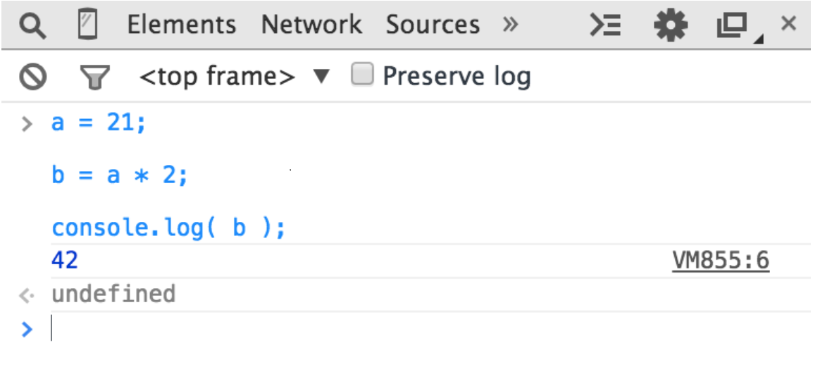
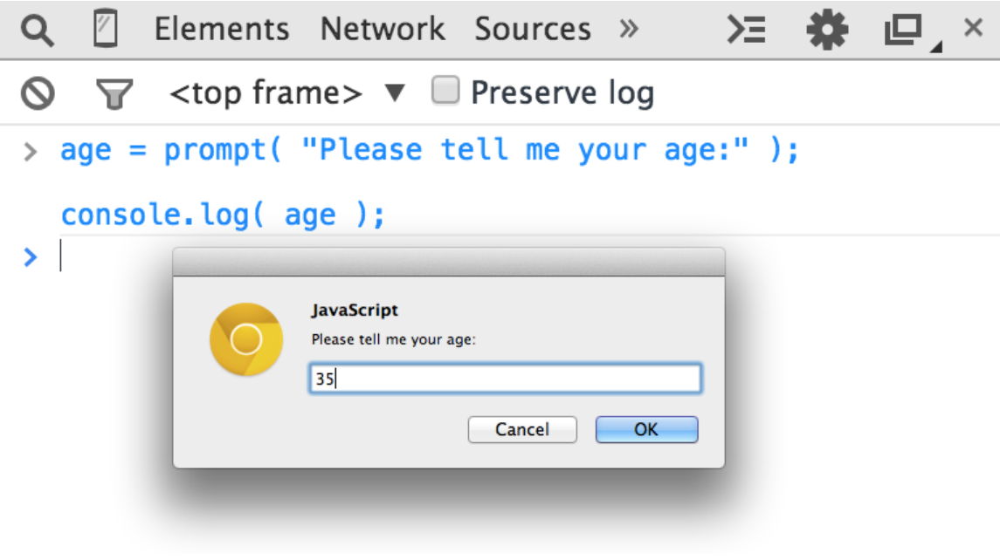
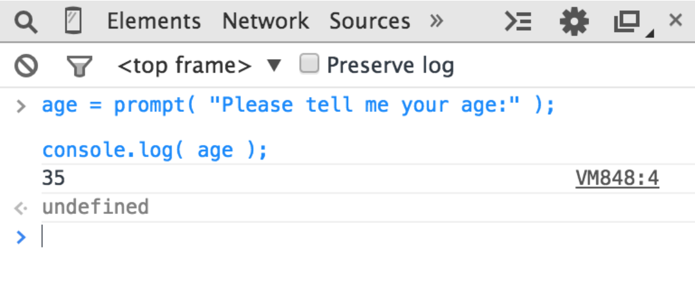

# "Ви не знаєте JS" Кайл Сімпсон

## Книга перша - "Почніть та вдосконалюйтесь" (Up & Go)

### Зміст

<details style="border: 1px solid #ccc; border-radius: 5px; margin-bottom: 10px; padding: 10px; background-color: #f9f9f9;">
  <summary style="cursor: pointer; font-weight: bold; font-size: 1.2em; color: #333;  padding: 8px; border-radius: 5px;">
    Передмова
  </summary>
  <div style="margin-top: 10px; padding: 10px; border-top: 1px solid #ccc; color: #000">
    
Що останнє нове ви вивчили?

Можливо, це була іноземна мова, як-от італійська чи німецька. Або, можливо, це був графічний редактор, як-от Photoshop. Чи техніка приготування їжі, або деревообробка, чи комплекс вправ. Я хочу, щоб ви згадали те відчуття, коли ви нарешті зрозуміли: той момент осяяння. Коли все перейшло від розмитого до кришталево чіткого, коли ви опанували циркулярну пилку чи зрозуміли різницю між чоловічим і жіночим родом іменників у французькій мові. Як це відчувалося? Досить неймовірно, чи не так?

А тепер я хочу, щоб ви повернулися трохи далі у своїх спогадах, до моменту перед тим, як ви опанували свою нову навичку. Як ви почувалися тоді? Мабуть, було трохи лячно і, можливо, трохи дратувало, правда ж? Колись ми всі не знали того, що знаємо зараз, і це цілком нормально – всі ми з чогось починаємо. Вивчення нового матеріалу – це захоплива пригода, особливо якщо ви прагнете опанувати предмет ефективно.

Я викладаю багато початкових курсів з програмування. Студенти, які відвідують мої заняття, часто намагалися самостійно вивчати такі предмети, як HTML чи JavaScript, читаючи блоґи або копіюючи та вставляючи код, але їм не вдалося по-справжньому опанувати матеріал, який дозволив би їм писати код для досягнення бажаного результату. І оскільки вони не до кінця розуміють усі тонкощі певних тем програмування, вони не можуть писати потужний код чи налагоджувати власні розробки, бо насправді не розуміють, що відбувається.

Я завжди вірю в правильне викладання на своїх заняттях, тобто я навчаю веб-стандартів, семантичної розмітки, коду з належними коментарями та інших найкращих практик. Я висвітлюю предмет ґрунтовно, пояснюючи як і чому, замість того, щоб просто викидати код для копіювання та вставлення. Коли ви прагнете зрозуміти свій код, ви створюєте кращі роботи і стаєте кращими в тому, що робите. Код перестає бути просто вашою роботою, він стає вашим ремеслом. Саме тому я в захваті від "Почніть та вдосконалюйтесь". Кайл веде нас у глибоке занурення через синтаксис та термінологію, щоб дати чудовий вступ до JavaScript без зрізання кутів. Ця книга не ковзає по поверхні, а дійсно дозволяє нам по-справжньому зрозуміти концепції.

Адже недостатньо просто вміти копіювати фрагменти jQuery у свій вебсайт, так само як недостатньо навчитися відкривати, закривати та зберігати документ у Photoshop. Звісно, коли я вивчив кілька основ програми, я міг створювати та ділитися зробленим дизайном. Але без справжнього знання інструментів та того, що за ними стоїть, як я можу визначити сітку, або створити читабельну систему шрифтів, або оптимізувати графіку для використання в вебі. Те саме стосується JavaScript. Не знаючи, як працюють цикли, як визначати змінні чи що таке область видимості, ми не писатимемо найкращий код, на який здатні. Ми не хочемо погоджуватися на щось менше — це все-таки наше ремесло.

Чим більше ви стикаєтеся з JavaScript, тим зрозумілішим він стає. Слова на кшталт замикань, об'єктів та методів можуть здаватися вам зараз недосяжними, але ця книга допоможе цим термінам стати зрозумілими. Я хочу, щоб ви пам'ятали ті два відчуття – до і після вивчення чогось – коли починаєте читати цю книгу. Це може здаватися складним, але ви взяли цю книгу до рук, тому що розпочинаєте чудову подорож до вдосконалення своїх знань. "Почніть та вдосконалюйтесь" – це початок нашого шляху до розуміння програмування. Насолоджуйтесь моментами осяяння!

*—Jenn Lukas (http://jennlukas.com, @jennlukas),
Frontend consultant*
  </div>
</details>

<details style="border: 1px solid #ccc; border-radius: 5px; margin-bottom: 10px; padding: 10px; background-color: #f9f9f9;">
  <summary style="cursor: pointer; font-weight: bold; font-size: 1.2em; color: #333; padding: 8px; border-radius: 5px;">
    Вступ
  </summary>
  <div style="margin-top: 10px; padding: 10px; border-top: 1px solid #ccc; color: #000">

Я впевнений, ви помітили, але "JS" у назві серії – це не абревіатура слів для лайки про JavaScript, хоча лаятися через дивацтва цієї мови – це те, з чим ми, мабуть, усі можемо себе ототожнити!

Від найперших днів Вебу JavaScript був фундаментальною технологією, що керує інтерактивним досвідом навколо контенту, який ми споживаємо. Хоча JavaScript починався з мерехтливих слідів від миші та надокучливих спливаючих вікон, майже два десятиліття потому технологія та можливості JavaScript зросли на багато порядків, і мало хто сумнівається в його важливості в самому серці найдоступнішої програмної платформи світу: Вебу.

Але як мова програмування, вона постійно була мішенню для численної критики, частково через своє походження, але ще більше через свою філософію проєктування. Навіть сама назва викликає, як одного разу висловився Брендан Айк, статус "тупого молодшого брата" поруч з його більш зрілим старшим братом, Java. Але ця назва – лише випадковість політики та маркетингу. Ці дві мови надзвичайно різні в багатьох важливих аспектах. "JavaScript" настільки ж пов'язаний з "Java", як "карнавал" з "каром".

Оскільки JavaScript запозичує концепції та синтаксичні ідіоми з кількох мов, включаючи горді процедурні корені в стилі C, а також витончені, менш очевидні функціональні корені в стилі Scheme/Lisp, він надзвичайно доступний для широкої аудиторії розробників, навіть тих, хто має мало або взагалі не має досвіду програмування. "Hello World" у JavaScript настільки простий, що мова є привабливою та легкою для освоєння при першому знайомстві.

Хоча JavaScript, можливо, є однією з найпростіших мов для початку роботи, його особливості роблять ґрунтовне опанування мови значно рідшим явищем, ніж у багатьох інших мовах. Якщо для написання повномасштабної програми потрібне досить глибоке знання такої мови, як C чи C++, то повномасштабна продакшн-розробка на JavaScript може, і часто так і відбувається, лише поверхнево торкатися можливостей мови.

Складні концепції, що глибоко вкорінені в мову, натомість зазвичай проявляють себе в начебто спрощений спосіб, як-от передача функцій як зворотних викликів, що заохочує розробника JavaScript просто використовувати мову як є і не надто перейматися тим, що відбувається під капотом.

Це одночасно проста, легка у використанні мова, що має широку привабливість, та складна й нюансована сукупність мовних механізмів, які без ретельного вивчення вислизають від справжнього розуміння навіть для найдосвідченіших JavaScript-розробників.

У цьому й полягає парадокс JavaScript, ахіллесова п'ята мови, виклик, який ми зараз розглядаємо. Оскільки JavaScript можна використовувати без розуміння, справжнє розуміння мови часто так і не досягається.

### Місія

Якщо щоразу, коли ви натрапляєте на несподіванку чи розчарування в JavaScript, ваша реакція – додати це до чорного списку (як дехто звик робити), ви скоро будете обмежені лише порожньою оболонкою багатства JavaScript.

Хоча цей підмножина славнозвісно названа "Хорошими частинами" (The Good Parts), я б благав вас, шановний читачу, натомість розглядати її як "Легкі частини", "Безпечні частини" чи навіть "Неповні частини".

Ця серія "Ви не знаєте JS" пропонує протилежний виклик: вивчити та глибоко зрозуміти весь JavaScript, включно й особливо "Складні частини".

Тут ми безпосередньо розглядаємо тенденцію JavaScript-розробників вчити рівно стільки, щоб справлятися з роботою, ніколи не змушуючи себе дізнатися точно, як і чому мова поводиться саме так. Більше того, ми відкидаємо поширену пораду відступати, коли шлях стає складним.

Я не задовольняюся, і ви не повинні задовольнятися тим, щоб зупинятися, коли щось просто працює, не розуміючи чому. Я м'яко закликаю вас вирушити цим вибоїстим "менш второваним шляхом" і прийняти все, чим є і що може робити JavaScript. З цими знаннями жодна техніка, жоден фреймворк і жоден популярний модний акронім тижня не буде поза межами вашого розуміння.

Кожна з цих книг розглядає конкретні базові частини мови, які найчастіше неправильно розуміють або недостатньо розуміють, і занурюється в них глибоко та вичерпно. Після прочитання ви повинні набути твердої впевненості у своєму розумінні не лише теоретичних аспектів, а й практичних  моментів, які "потрібно знати".

JavaScript, який ви знаєте зараз, ймовірно, складається з частин, переданих вам іншими, які обпеклися через неповне розуміння. Цей JavaScript – лише тінь справжньої мови. Ви ще не справді знаєте JavaScript, але якщо ви заглибитеся в цю серію, то пізнаєте. Читайте далі, мої друзі. JavaScript чекає на вас.

### Огляд

JavaScript - чудовий. Його легко вивчити частково, і набагато складніше вивчити повністю (чи навіть достатньо). Коли розробники стикаються з незрозумілими моментами, вони зазвичай звинувачують мову замість свого нерозуміння. Ці книги мають на меті це виправити, надихаючи на глибоку повагу до мови, яку ви тепер можете і повинні ґрунтовно знати.

**Примітка:** *Багато прикладів у цій книзі розраховані на сучасні (та орієнтовані на майбутнє) середовища рушіїв JavaScript, такі як ES6. Деякий код може не працювати так, як описано, якщо запускати його на старіших (до-ES6) рушіях.*

### Умовні позначення, що використовуються в цій книзі

У цій книзі використовуються такі типографічні умовності:

*Курсив*

Позначає нові терміни, URL-адреси, електронні адреси, назви файлів і розширення файлів.

`Моноширинний шрифт`

Використовується для програмного коду, а також у межах абзаців для позначення елементів програми, таких як назви змінних чи функцій, бази даних, типи даних, змінні середовища, оператори та ключові слова.

**`Моноширинний жирний`**

Показує команди чи інший текст, який користувач повинен вводити дослівно.

*`Моноширинний курсив`*

Показує текст, який має бути замінений значеннями, що надає користувач, або значеннями, які визначаються контекстом.

  </div>
</details>


<details style="border: 1px solid #ccc; border-radius: 5px; margin-bottom: 10px; padding: 10px; background-color: #f9f9f9;">
<summary style="cursor: pointer; font-weight: bold; font-size: 1.2em; color: #333; padding: 8px; border-radius: 5px;">
    РОЗДІЛ 1
</summary>

<div style="margin-top: 10px; padding: 10px; border-top: 1px solid #ccc; color: #000">

  ### Введення в програмування

Ласкаво просимо до серії книг "Ви не знаєте JS" (YDKJS).

"Почніть та вдосконалюйтесь" є вступом до кількох базових концепцій програмування – звісно, ми схиляємося конкретно до JavaScript (часто скорочується як JS) – і того, як підходити до розуміння решти книг цієї серії. Особливо якщо ви тільки починаєте знайомитися з програмуванням та/або JavaScript, ця книга коротко розгляне все, що вам потрібно для початку роботи.

Ця книга починається з пояснення базових принципів програмування на дуже високому рівні. Вона здебільшого призначена для тих, хто починає вивчення YDKJS з невеликим досвідом програмування або взагалі без нього, і розглядає ці книги як допомогу в розумінні програмування через призму JavaScript.

Якщо ви вже досить добре знайомі з JavaScript, спочатку погляньте на Розділ 3, щоб коротко ознайомитися з тим, чого очікувати від YDKJS, а потім сміливо починайте!

До Розділу 1 варто підходити як до швидкого огляду речей, які ви захочете вивчити глибше та попрактикувати для входження в програмування. Також існує багато інших чудових ресурсів для знайомства з програмуванням, які можуть допомогти вам глибше зануритися в ці теми, і я заохочую вас вчитися з них на додаток до цього розділу.

Коли ви почуватиметеся впевнено з загальними основами програмування, [Розділ 2](#section2) допоможе вам познайомитися з особливостями програмування на JavaScript. [Розділ 2](#section2) знайомить з тим, що таке JavaScript, але знову ж таки, це не вичерпний посібник – для цього існують інші книги серії YDKJS!

<!-- ================ subsection ================ -->


<div style="margin-top: 10px; padding: 10px; border-top: 1px solid #ccc; color: #000">
<details style="border: 1px solid #ccc; border-radius: 5px; margin-bottom: 10px; padding: 10px; background-color: #f9f9f9;">
<summary style="cursor: pointer; font-weight: bold; font-size: 1.1em; color: #333; padding: 8px; border-radius: 5px;">
        Код (Code)
</summary>
<div style="margin-top: 10px; padding: 10px; border-top: 1px solid #ccc; color: fff; color: #000">
Почнемо з початку.

Програма, яку часто називають вихідним кодом (source code) або просто кодом, – це набір спеціальних інструкцій, які вказують комп'ютеру, які завдання виконувати. Зазвичай код зберігається в текстовому файлі, хоча з JavaScript ви також можете вводити код безпосередньо в консоль розробника в браузері, про що ми поговоримо незабаром.

Правила для допустимого формату та комбінацій інструкцій називаються мовою програмування, іноді її називають синтаксисом, багато в чому так само, як англійська мова вказує вам, як писати слова та як створювати правильні речення, використовуючи слова та пунктуацію.

</div>
</details>
</div>

<!-- ================ subsection ================ -->

<div style="margin-top: 10px; padding: 10px; border-top: 1px solid #ccc; color: #000">
<details style="border: 1px solid #ccc; border-radius: 5px; margin-bottom: 10px; padding: 10px; background-color: #f9f9f9;">
<summary style="cursor: pointer; font-weight: bold; font-size: 1.1em; color: #333; padding: 8px; border-radius: 5px;">
        Інструкції (Statements)
</summary>
<div style="margin-top: 10px; padding: 10px; border-top: 1px solid #ccc; color: fff; color: #000">

У мові програмування група слів, чисел та операторів, що виконує конкретне завдання, називається інструкцією. У JavaScript інструкція може виглядати так:

```javascript
a = b * 2; 
``` 

Символи `a` та `b` називаються змінними *(variables)* (див. главу "Змінні"), які подібні до простих коробок, де ви можете зберігати будь-які свої речі. У програмах змінні *(variables)* містять значення (наприклад, число `42`), які програма буде використовувати. Думайте про них як про символічні заповнювачі для самих значень.

Натомість, `2` – це просто саме значення, яке називається літеральним значенням *(literal value)*, оскільки воно існує самостійно, не зберігаючись у змінній.
Символи `=` та `*` – це оператори (див. главу "Оператори") – вони виконують дії зі значеннями та змінними, такі як присвоєння та математичне множення.

Більшість інструкцій у JavaScript завершуються крапкою з комою (`;`) в кінці.

Інструкція `a = b * 2;` приблизно каже комп'ютеру отримати поточне значення, що зберігається в змінній `b`, помножити це значення на `2`, потім зберегти результат в іншу змінну, яку ми називаємо `a`.

Програми – це просто набори багатьох таких інструкцій, які разом описують усі кроки, необхідні для виконання призначення вашої програми.

</div>
</details>
</div>

<!-- ================ subsection ================ -->

<div style="margin-top: 10px; padding: 10px; border-top: 1px solid #ccc; color: #000">
<details style="border: 1px solid #ccc; border-radius: 5px; margin-bottom: 10px; padding: 10px; background-color: #f9f9f9;">
<summary style="cursor: pointer; font-weight: bold; font-size: 1.1em; color: #333; padding: 8px; border-radius: 5px;">
Вирази (Expressions)
</summary>
<div style="margin-top: 10px; padding: 10px; border-top: 1px solid #ccc; color: fff; color: #000">

Інструкції *(Statements)* складаються з одного або декількох виразів *(Expressions)*. Вираз – це будь-яке посилання на змінну чи значення, або набір змінних та значень, поєднаних операторами. 

Наприклад:
```javascript
a = b * 2;
``` 

Ця інструкція містить чотири вирази:

- `2` – це вираз літерального значення.
- `b` – це вираз змінної, що означає отримання її поточного значення.
- `b * 2` – це арифметичний вираз, який означає виконання множення.
- `a = b * 2` – це вираз присвоєння, який означає присвоєння результату виразу `b * 2` змінній a (детальніше про присвоєння пізніше).

Загальний вираз, що стоїть окремо, також називається виразом-інструкцією, наприклад:

```javascript
b * 2;
```

Такий тип виразу-інструкції не є дуже поширеним чи корисним, оскільки зазвичай він не матиме жодного впливу на виконання програми – він отримає значення `b` і помножить його на `2`, але потім нічого не зробить з цим результатом.

Більш поширеним виразом-інструкцією є інструкція виклику функції *(див. главу "Функції")*, де вся інструкція є власне виразом виклику функції:

```javascript
alert( a );
```

</div>
</details>
</div>

<!-- ================ subsection ================ -->

<div style="margin-top: 10px; padding: 10px; border-top: 1px solid #ccc; color: #000">
<details style="border: 1px solid #ccc; border-radius: 5px; margin-bottom: 10px; padding: 10px; background-color: #f9f9f9;">
<summary style="cursor: pointer; font-weight: bold; font-size: 1.1em; color: #333; padding: 8px; border-radius: 5px;">
Виконання програми (Executing a Program)

</summary>
<div style="margin-top: 10px; padding: 10px; border-top: 1px solid #ccc; color: fff; color: #000">

Як ці набори програмних інструкцій повідомляють комп'ютеру, що робити? Програму потрібно виконати *(execute)*, що також називають запуском програми *(running a program)*.

Інструкції на кшталт `a = b * 2` корисні для розробників під час читання та написання коду, але вони не є у формі, яку комп'ютер може безпосередньо зрозуміти. Тому спеціальна утиліта на комп'ютері (інтерпретатор або компілятор) використовується для перекладу написаного вами коду в команди, зрозумілі комп'ютеру.

Для деяких мов програмування цей переклад команд зазвичай виконується згори донизу, рядок за рядком, щоразу, коли програма запускається, що зазвичай називають інтерпретацією коду.

Для інших мов переклад виконується заздалегідь, що називається компіляцією коду, тому коли програма запускається пізніше, виконуються вже скомпільовані комп'ютерні інструкції, готові до роботи.

Зазвичай стверджують, що JavaScript є інтерпретованою мовою, оскільки ваш вихідний код JavaScript обробляється щоразу під час його запуску. Але це не зовсім точно. Рушій JavaScript насправді компілює програму на льоту і потім одразу виконує скомпільований код.

**Примітка:** *Для отримання детальнішої інформації про компіляцію JavaScript дивіться перші два розділи книги "Область Видимості та Замикання" (Scope & Closures) з цієї серії.*

</div>
</details>
</div>

<!-- ================ subsection ================ -->

<div style="margin-top: 10px; padding: 10px; border-top: 1px solid #ccc; color: #000">
<details style="border: 1px solid #ccc; border-radius: 5px; margin-bottom: 10px; padding: 10px; background-color: #f9f9f9;">
<summary style="cursor: pointer; font-weight: bold; font-size: 1.1em; color: #333; padding: 8px; border-radius: 5px;">
Спробуйте самі (Try It Yourself)
</summary>
<div style="margin-top: 10px; padding: 10px; border-top: 1px solid #ccc; color: fff; color: #000">

Цей розділ представить кожну концепцію програмування за допомогою простих фрагментів коду, написаних мовою JavaScript (звісно!).

Не можна достатньо наголосити: поки ви опрацьовуєте цей розділ – і вам, можливо, доведеться витратити час, щоб переглянути його кілька разів – вам слід практикувати кожну з цих концепцій, набираючи код самостійно. Найпростіший спосіб зробити це – відкрити консоль інструментів розробника у вашому браузері (Firefox, Chrome, IE тощо).        

**Примітка:** *Зазвичай ви можете запустити консоль розробника за допомогою комбінації клавіш або через пункт меню. Щоб отримати детальнішу інформацію про запуск та використання консолі у вашому улюбленому браузері, дивіться розділ "Опанування консолі інструментів розробника" (Mastering The Developer Tools Console). Щоб ввести кілька рядків у консоль одночасно, використовуйте <shift> + <enter> для переходу на новий рядок. Коли ви натиснете <enter> окремо, консоль виконає все, що ви щойно ввели.*

Давайте ознайомимося з процесом виконання коду в консолі. Спочатку я пропоную відкрити порожню вкладку у вашому браузері. Я надаю перевагу робити це, ввівши about:blank в адресний рядок. Потім переконайтеся, що ваша консоль розробника відкрита, як ми щойно зазначали. Тепер введіть цей код і подивіться, як він виконується:

```javascript
a = 21;
b = a * 2;
console.log( b );
```
Введення наведеного вище коду в консоль Chrome має видати щось на кшталт такого результату: `42`



Спробуйте! Найкращий спосіб вивчити програмування – це почати писати код!


### Input (Виведення)

У попередньому фрагменті коду ми використали `console.log(..)`. Давайте коротко розглянемо, що означає цей рядок коду.

Ви, можливо, здогадалися, але саме так ми виводимо текст (тобто виводимо дані для користувача) в консолі розробника. В цій інструкції є дві характеристики, які ми маємо пояснити.

По-перше, частина `log( b )` називається викликом функції (див. главу "Функції"). Відбувається те, що ми передаємо змінну `b` цій функції, яка бере значення `b` і виводить його в консоль.

По-друге, частина `console.` є посиланням на об'єкт, де розташована функція log(..). Ми розглянемо об'єкти та їхні властивості детальніше в [Розділі 2](#section2).

Інший спосіб створення виведення, яке ви можете побачити – це виконати інструкцію `alert(..)`. 

Наприклад:

```javascript
alert( b );
```

Якщо ви це виконаєте, то помітите, що замість виведення в консоль, з'явиться спливаюче вікно `"OK"` зі вмістом змінної `b`. 

Проте використання `console.log(..)` зазвичай полегшує вивчення програмування та виконання ваших програм у консолі порівняно з `alert(..)`, оскільки ви можете виводити багато значень одночасно, не перериваючи роботу інтерфейсу браузера. У цій книзі ми використовуватимемо `console.log(..)` для виведення.


### Введення (Input)

Поки ми обговорюємо виведення, ви також можете поцікавитися введенням *(input)* (тобто отриманням інформації від користувача).

Найпоширеніший спосіб – це показати на HTML-сторінці елементи форми (наприклад, текстові поля), в які користувач може вводити дані, а потім використовувати JS для зчитування цих значень у змінні вашої програми.

Але для простого навчання та демонстраційних цілей, якими ви займатиметесь протягом цієї книги, існує простіший спосіб отримання введення. Використовуйте функцію `prompt(..)`:

```javascript
age = prompt( "Please tell me your age:" );
console.log( age );
```
Як ви могли здогадатися, повідомлення, яке ви передаєте в`prompt(..)` – у цьому випадку `"Please tell me your age:"` – виводиться у спливаючому вікні.

Це має виглядати приблизно так:



Після того, як ви відправите введений текст, натиснувши *"OK"*, ви побачите, що введене вами значення зберігається в змінній `age`, яку ми потім виводимо за допомогою `console.log(..)`.



Щоб зберегти простоту під час вивчення основних концепцій програмування, приклади в цій книзі не вимагатимуть введення даних. Але тепер, коли ви побачили, як використовувати `prompt(..)`, якщо хочете випробувати себе, ви можете спробувати використовувати введення даних у своїх експериментах з прикладами.

</div>
</details>
</div>

<!-- ================ subsection ================ -->

<div style="margin-top: 10px; padding: 10px; border-top: 1px solid #ccc; color: #000">
<details style="border: 1px solid #ccc; border-radius: 5px; margin-bottom: 10px; padding: 10px; background-color: #f9f9f9;">
<summary style="cursor: pointer; font-weight: bold; font-size: 1.1em; color: #333; padding: 8px; border-radius: 5px;">
        Оператори (Operators)
</summary>
<div style="margin-top: 10px; padding: 10px; border-top: 1px solid #ccc; color: fff; color: #000">

Оператори - це те, як ми виконуємо дії над змінними та значеннями. Ми вже бачили два оператори JavaScript: `=` та `*`.
Оператор `*` виконує математичне множення. Досить просто, правда?
Оператор `=` (дорівнює) використовується для присвоєння – спочатку ми обчислюємо значення з правого боку (вихідне значення) від `=`, а потім поміщаємо його в змінну, яку ми вказуємо з лівого боку (цільова змінна).

**Примітка:** *Такий порядок присвоєння може здатися дивним. Замість `a = 42`, дехто міг би віддати перевагу зворотному порядку, де вихідне значення зліва, а цільова змінна справа, як-от `42 ->` a (це не валідний JavaScript!). На жаль, форма `a = 42` та подібні варіації досить поширені в сучасних мовах програмування. Якщо це здається неприродним, просто витратьте деякий час на повторення цього порядку подумки, щоб звикнути.*

Розглянемо:

```javascript
a = 2;
b = a + 1;
```

Тут ми присвоюємо значення `2` змінній `a`. Потім ми отримуємо значення змінної a (все ще 2), додаємо до нього `1`, отримуючи значення `3`, а потім зберігаємо це значення в змінній `b`.

Хоча технічно це не оператор, вам знадобиться ключове слово `var` у кожній програмі, оскільки це основний спосіб оголошення (тобто створення) змінних (див. главу "Змінні").

Ви завжди повинні оголошувати змінну за іменем перед її використанням. Але вам потрібно оголосити змінну лише один раз для кожної області видимості (див. главу "Область видимості"); після цього її можна використовувати стільки разів, скільки потрібно. Наприклад:

```javascript
var a = 20;
a = a + 1;
a = a * 2;

console.log( a ); // 42
```

Ось деякі з найпоширеніших операторів у JavaScript:

**Присвоєння *(Assignment)***

`=`, як у `a = 2`.

**Математичні *(Math)***

`+` додавання *(addition)*, `-` віднімання *(substraction)*, `*` множення *(multiplication)* та `/`  ділення *(division)*, як у `a * 3`.


**Складене присвоєння *(Compound assignment)***

`+=`, `-=`, `*=`, та `/=` - це складені оператори, які поєднують математичну операцію з присвоєнням, як у `a += 2` (те саме, що й `a = a + 2`).

**Інкремент/декремент *(Increment/decrement)***

`++` (інкремент), `--` (декремент), як у `a++` (подібно до `a = a + 1`).

**Доступ до властивостей об'єкта *(Object property access)***

`.` як у `console.log()`.

Об'єкти - це значення, які містять інші значення в певних іменованих місцях, які називаються властивостями. obj.a означає об'єктне значення під назвою obj з властивістю з іменем a. До властивостей також можна отримати доступ як `obj["a"]`. Див. [Розділ 2](#section2).

**Рівність *(Equality)***

`==` нестрога рівність *(loose-equals)* , `===` строга рівність *(strict-equals)*, `!=` нестрога нерівність *(loose not-equals)*, `!==` строга нерівність *(strict not-equals)*, як у `a == b` (див. "Значення і типи" та [Розділ 2](#section2)).

**Порівняння *(Comparison)***

`<` менше *(less than)*, `>` більше *(greater than)*, `<=` менше або нестрого дорівнює *(less than or loose-equals)*, `>=` більше або нестрого дорівнює *(greater than or loose-equals)*, як у `a <= b` (див. "Значення і типи" та [Розділ 2](#section2)).

**Логічні *(Logical)***

`&&` "і" (and), `||` "або" (or), як у `a || b`, що вибирає або `a` або `b`.
Ці оператори використовуються для вираження складених умов (див. "Умовні конструкції"), наприклад, якщо істинне або `a`, або `b`.

**Примітка:** *Для отримання більш детальної інформації та огляду операторів, не згаданих тут, дивіться ["Вирази та оператори" (Expressions and Operators)](https://developer.mozilla.org/en-US/docs/Web/JavaScript/Guide/Expressions_and_operators) в Mozilla Developer Network (MDN).*


</div>
</details>
</div>

<!-- ================ subsection ================ -->

<div style="margin-top: 10px; padding: 10px; border-top: 1px solid #ccc; color: #000">
<details style="border: 1px solid #ccc; border-radius: 5px; margin-bottom: 10px; padding: 10px; background-color: #f9f9f9;">
<summary style="cursor: pointer; font-weight: bold; font-size: 1.1em; color: #333; padding: 8px; border-radius: 5px;">
        Глава
</summary>
<div style="margin-top: 10px; padding: 10px; border-top: 1px solid #ccc; color: fff; color: #000">
        Текст розділу 

```javascript
console.log("HW")
``` 

</div>
</details>
</div>

<!-- ================ subsection ================ -->

<div style="margin-top: 10px; padding: 10px; border-top: 1px solid #ccc; color: #000">
<details style="border: 1px solid #ccc; border-radius: 5px; margin-bottom: 10px; padding: 10px; background-color: #f9f9f9;">
<summary style="cursor: pointer; font-weight: bold; font-size: 1.1em; color: #333; padding: 8px; border-radius: 5px;">
        Глава
</summary>
<div style="margin-top: 10px; padding: 10px; border-top: 1px solid #ccc; color: fff; color: #000">
        Текст розділу 

```javascript
console.log("HW")
``` 

</div>
</details>
</div>

<!-- ================ subsection ================ -->

<div style="margin-top: 10px; padding: 10px; border-top: 1px solid #ccc; color: #000">
<details style="border: 1px solid #ccc; border-radius: 5px; margin-bottom: 10px; padding: 10px; background-color: #f9f9f9;">
<summary style="cursor: pointer; font-weight: bold; font-size: 1.1em; color: #333; padding: 8px; border-radius: 5px;">
        Глава
</summary>
<div style="margin-top: 10px; padding: 10px; border-top: 1px solid #ccc; color: fff; color: #000">
        Текст розділу 

```javascript
console.log("HW")
``` 

</div>
</details>
</div>

<!-- ================ subsection ================ -->

<div style="margin-top: 10px; padding: 10px; border-top: 1px solid #ccc; color: #000">
<details style="border: 1px solid #ccc; border-radius: 5px; margin-bottom: 10px; padding: 10px; background-color: #f9f9f9;">
<summary style="cursor: pointer; font-weight: bold; font-size: 1.1em; color: #333; padding: 8px; border-radius: 5px;">
        Глава
</summary>
<div style="margin-top: 10px; padding: 10px; border-top: 1px solid #ccc; color: fff; color: #000">
        Текст розділу 

```javascript
console.log("HW")
``` 

</div>
</details>
</div>

<!-- ================ subsection ================ -->

<div style="margin-top: 10px; padding: 10px; border-top: 1px solid #ccc; color: #000">
<details style="border: 1px solid #ccc; border-radius: 5px; margin-bottom: 10px; padding: 10px; background-color: #f9f9f9;">
<summary style="cursor: pointer; font-weight: bold; font-size: 1.1em; color: #333; padding: 8px; border-radius: 5px;">
        Глава
</summary>
<div style="margin-top: 10px; padding: 10px; border-top: 1px solid #ccc; color: fff; color: #000">
        Текст розділу 

```javascript
console.log("HW")
``` 

</div>
</details>
</div>

<!-- ================ subsection ================ -->


  </div>
</details>


<details id="section2" style="border: 1px solid #ccc; border-radius: 5px; margin-bottom: 10px; padding: 10px; background-color: #f9f9f9;">
  <summary style="cursor: pointer; font-weight: bold; font-size: 1.2em; color: #333; padding: 8px; border-radius: 5px;">
    РОЗДІЛ 2
  </summary>
  <div style="margin-top: 10px; padding: 10px; border-top: 1px solid #ccc; color: #000">
    
  <div style="margin-top: 10px; padding: 10px; border-top: 1px solid #ccc; color: #000">
    <details style="border: 1px solid #ccc; border-radius: 5px; margin-bottom: 10px; padding: 10px; background-color: #f9f9f9;">
      <summary style="cursor: pointer; font-weight: bold; font-size: 1.1em; color: #333; padding: 8px; border-radius: 5px;">
        Глава
      </summary>
  <div style="margin-top: 10px; padding: 10px; border-top: 1px solid #ccc; color: fff; color: #000">
        Текст глави


```javascript
console.log("HW")
``` 

  </div>
    </details>
  </div>

  </div>
</details>


<details style="border: 1px solid #ccc; border-radius: 5px; margin-bottom: 10px; padding: 10px; background-color: #f9f9f9;">
  <summary style="cursor: pointer; font-weight: bold; font-size: 1.2em; color: #333; padding: 8px; border-radius: 5px;">
    РОЗДІЛ 3
  </summary>

  <div style="margin-top: 10px; padding: 10px; border-top: 1px solid #ccc; color: #000">
    
  <div style="margin-top: 10px; padding: 10px; border-top: 1px solid #ccc; color: #000">
    <details style="border: 1px solid #ccc; border-radius: 5px; margin-bottom: 10px; padding: 10px; background-color: #f9f9f9;">
      <summary style="cursor: pointer; font-weight: bold; font-size: 1.1em; color: #333; padding: 8px; border-radius: 5px;">
        Глава
      </summary>
  <div style="margin-top: 10px; padding: 10px; border-top: 1px solid #ccc; color: fff; color: #000">
        Текст глави


```javascript
console.log("HW")
``` 

  </div>
    </details>
  </div>

  </div>
</details>